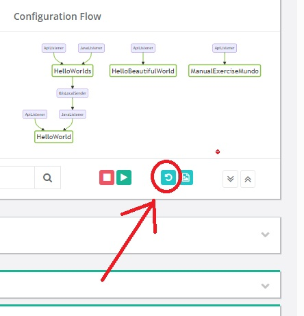

Editing your configurations graphically
=======================================

In the previous section you learned to start the Frank!Framework with docker. With that set-up, you can already edit your configurations in a text editor. The files you edit on your device's ``configurations`` folder are seen by your Docker container as files in ``opt/frank/configurations``. After editing you can thus press the refresh button (see below, Adapter Status page screen capture from https://frank2example.frankframework.org) to load your edits.

This section explains how you can edit your Frank configurations graphically as flow charts. You can do this using the Frank!Flow that runs in your webbrowser. It can show your configurations as flow charts in which you can drag-and-drop pipes, senders and receivers. The Frank!Flow also allows you to edit your configurations as XML files.

Please do the following to set this up:

1. Update your ``docker-compose.yml`` as shown:

   .. include:: ../../snippets/Frank2DockerDevel/v510/dockerComposeAddFrankFlow.txt

   This does the following:

   * It selects the latest nightly build of the Frank!Framework. On July 7 2024 this does not work in an official release yet.
   * It sets property ``management.gateway.inbound.class`` so that the Frank!Framework is reachable by the Frank!Flow. The Frank!Flow can then ask the Frank!Framework for the location of the Frank configurations.
   * It creates an alias for the volume you use for your configurations.
   * It adds a service for the Frank!Flow. That service uses an image provided by WeAreFrank!. The service uses the same volume declaration as the Frank!Framework service so that configurations are at the same directory in the docker container.

2. When you restart your work with ``docker-compose up``, you can visit the Frank!Flow at http://localhost:8081

.. NOTE::

   If you edit your configuration with the Frank!Flow, you do not need to reference ``FrankConfig.xsd`` in your configuration. You have syntax highlighting if you just use `<Configuration>` or `<Module>`; no need for `xsi:noNamespaceSchemaLocation="../FrankConfig.xsd"`.