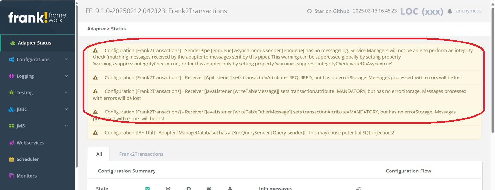

.. _advancedDevelopmentIntegrationPatternsConsoleWarnings:

Console warnings
================

It is critical that Frank developers ensure that the right error stores are added. In addition, Frank developers should take care to add message logs. These are audit logs where incoming and outgoing messages are stored for some time. See :ref:`managingProcessedMessagesLog`. If the Frank!Framework suspects that some error stores or message logs are forgotten by the Frank developer, it produces console warnings like shown below:

The Frank!Framework sometimes suspects that an error store or message log is missing when this is not really the case. In the exercise of the previous section, there was an adapter that called sub-adapters. The Frank!Framework complained that these sub-adapters did not have error stores. This was no problem however, because the parent adapter did have an error store. The Frank!Framework did not take into account that the sub-adapters were only called from this parent adapter.

Something similar can apply with a sender. If the incoming message is the same as the outgoing message and if the receiver already has a message log, then the Frank!Framework still complains that the sender does not have a message log.

Frank developers should suppress console warnings that do not really reveal issues. To do this, please copy some part of the warning and search for it in the log file (under Logging in the main menu). In the log file, you will find how to suppress the warning (typically by setting a property). For example, the shown warnings are suppressed with the following property settings:

.. include:: ../../snippets/Frank2Transactions/v512/suppressWarnings.txt
