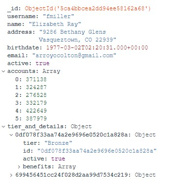

.. _advancedDevelopmentMongoDB:

MongoDB
=======

MongoDB is an alternative for relational databases like Oracle and MySQL. It distinguishes itself because data is not stored in tables. Instead, JSON-like objects are stored. A stored object is a list of key/value pairs in which a value can be a scalar (string, number or date), a list or a map of nested key/value pairs. Here is an example of a document as it appears in MongoDB Compass:

Using MongoDB can have the following advantages over using a regular database:

* There is no need to have a database schema. It is easy to add new fields to your dataset.
* MongoDB scales better than regular databases.
* MongoDB has built-in support for geospatial data. You can for example query documents that have a certain distance in kilometers from a location.

This section introduces you to MongoDB. Subsection :ref:`advancedDevelopmentMongoDBSetup` shows you how to get a database with sample data that you can use for experimenting. Subsection :ref:`advancedDevelopmentMongoDBQueries` explains the query language of MongoDB that you can use to query and modify data. The Frank!Framework allows you to send queries to MongoDB databases as is explained in subsection :ref:`advancedDevelopmentMongoDBFrank`. This way, you can read and write data in Frank configurations.

.. toctree::
   :maxdepth: 3

   setup
   queries
   frank
