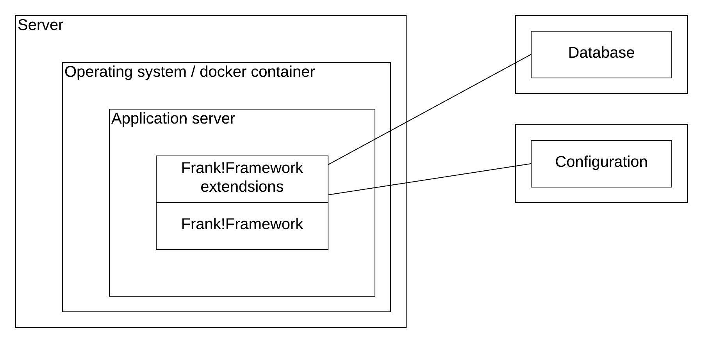

.. _propertiesDeploymentEnvironment:

Deployment Environment Characteristics
======================================

The introduction of this chapter introduced properties as the communication mechanism between a Frank and its deployment environment. In this subsection, we examine characteristics of this deployment environment.

Infrastructure
--------------

The figure below presents a general overview of the infrastructure used to deploy the Frank!Framework:

Of course, the Frank!Framework runs on some server (box "Server"). That server runs an operating system (Linux, Windows or MacOS), or a docker container is used to run other applications (box "Operating system / docker container"). Inside the operating system runs an application server, typically Apache Tomcat, JBoss Application Server (recently renamed to WildFly) or WebSphere Application Server. Application servers can receive HTTP requests and return HTTP responses. HTTP is the communication protocol used when you browse the internet with your webbrowser. Therefore you need an application server to build a website. HTTP is also used for communication between computers. Application servers and also the Frank!Framework have a web interface.

Within your application server you can deploy computer programs that are triggered when certain HTTP requests are received. The main property of an HTTP request is the URL (http://...), but headers and cookies are also relevant for routing incoming HTTP requests to computer programs deployed on the application server. The Frank!Framework is based on Java, so we are only concerned here with application servers that host Java classes.

The Frank!Framework is a Java application that has to be deployed on an application server(box "Frank!Framework"). Chapter :ref:`deploying` explains how you deploy your Frank on your application server. For now, you need to know the following. The Java source code of the Frank!Framework is compiled to byte code, a language similar to machine language. Machine language however is executed directly by the Central Processing Unit (CPU) of your server, while byte code is executed by the Java Virtual Machine (JVM). This scheme supports software developers who want their software to run on any operating system. Your application server runs the JVM, which executes the byte code of the compiled Frank!Framework. 

Please remember that a Frank configuration consists of three directories ``classes``, ``configurations`` and ``tests`` (see section :ref:`horizonsMultipleFiles`). The directory ``classes`` is named after the classpath, the internal file system of the Java Virtual Machine. Both the Frank!Framework and the contents of the ``classes`` folder of your Frank config (box "Frank!Framework extensions") appear on the classpath. The application server does not see the difference between the Frank!Framework and its extensions, typically the data of the ``classes`` folder within your development project.

In the past, there was no clear distinction between the Frank!Framework and Frank configs. Frank developers used the same development environment as the Java developers working on the Frank!Framework. A Frank config was deployed by compiling it along with the Java code of the Frank!Framework, resulting in one file containing byte code and other data. That file, with extension .jar, .war or .ear, was given to the application server. The application file then put the appropriate data on the classpath. The ``classes`` folder within your Frank config remains from that history.

WeAreFrank! is working on simplifying the development process for Frank configs. To this end, the Frank!Framework is being split from Frank configurations. WeAreFrank! has introduced the ``configurations`` and ``tests`` folders within Frank development projects. Both folders can deployed in a flexible way. They can be put on the file system of the server hosting your application server, but there are other possibilities as well. This is illustrated with the box "Configuration". The double box indicates any server running some application. Configurations may appear on the file system, or they may be stored in a database. Details are not documented right now, but will be documented later.

Finally, there is a box "Database". The database that is executed by the Frank!Framework and your Frank configurations is configured in the application server. The database may run on the same sever as the application server, but the database can also run on a different server.

The Frank!Framework detects the type of application server used to host it. This information appears in property ``application.server.type``. The following table shows for each application server the resulting value of ``application.server.type``:

==========================  ======================================
   application.server.type     Application server
--------------------------  --------------------------------------
   WAS                         WebSphere Application Server.
   TOMCAT                      Apache Tomcat.
   TOMCAT                      WeAreFrank! Quick Docker Installer.
   JBOSS                       JBoss Application Server
   TIBCOAMX                    Tibco AMX
==========================  ======================================

Logical characteristics
-----------------------

There are also logical characteristics of your deployment environment. These are not related to the infrastructure being used, but they reflect information about the way the deployment is used.

First, it is wise to differentiate between test environments and production environments. In general, an enterprise application is first tested by the development team on a development environment (D). If the development team considers a release, the application is deployed and tested on a test environment (T). If these tests are successful, the application is delivered to the customer. The customer deploys the application on a test environment for acceptance testing (A). Only when the acceptance tests succeed, the application is deployed on the production environment (P). This story explains the meaning of the DTAP acronym. At WeAreFrank!, we add the L (Local) for development testing on the laptop of an individual developer.

The Frank!Framework expects that the deployer sets property ``otap.stage`` to one of the following values: ``LOC``, ``DEV``, ``TST``, ``ACC`` or ``PRD``. Details on how to do this are in chapter :ref:`deploying`.

.. NOTE::

   OTAP is the Dutch version of the DTAP acronym. 

Second, the customer may have multiple departments or networks, each requiring its own fine-tuning. You can make your Frank configurable by using the property ``otap.side``. The default value of this property is ``xxx``. The system administrator deploying your Frank can freely choose a value for this property.

The three properties ``otap.stage``, ``application.server.type`` and ``otap.side`` influence the way that other property values are initialized. This is explained in the next subsection.
