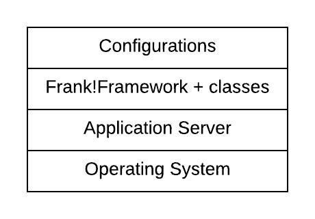

.. _propertiesDeploymentEnvironment:

Deployment Environment Characteristics
======================================

The introduction of this chapter introduced properties as the communication mechanism between a Frank config and its deployment environment. The previous subsection introduced properties with a short tutorial in which you defined and referenced properties. In this subsection, we link properties to characteristics of your deployment environment.

Infrastructure
--------------

The figure below presents a general overview of the infrastructure used to deploy the Frank!Framework:

The bottom layer shows the operating system of your server. On top of that you need an application server, typically Apache Tomcat, JBoss Application Server (recently renamed to WildFly) or WebSphere Application Server. The Frank!Framework is a Java web application, and it is the responsibility of the application server to serve it. The application server handles HTTP traffic. On top of the application server the Frank!Framework is deployed. When the Frank!Framework starts it looks for Frank configurations, which are not located within the deployment within your application server. The Frank configurations are loaded after the Frank!Framework itself. This is shown as the top layer, "Configurations". Please see chapter :ref:`deploying` for more information about deploying Frank configurations.

Inside the Frank!Framework layer, you also see the word "classes". This is a relic of the past. In the past the Frank!Framework often hosted only one Frank config and the distinction between the Frank!Framework and that Frank config was blurred. A trace of this practice remains now within the Frank!Runner. With the Frank!Runner, you can put common XML and property files in a folder ``classes`` that is a sibling of the ``configurations`` and ``tests`` folders. You can also put a Frank config there if you want, although this is considered bad practice. For the application server there is no distinction between the Frank!Framework and the ``classes`` folder, which is why these are grouped within the same layer. 

The shown stack is relevant for Frank developers because it influences the way properties can be used. When the application server is started, it gets property definitions from the operating system and from command-line arguments (system properties). The application server then boots the Frank!Framework. During this process, application properties are read from the deployed Frank!Framework and the extra data added there (i.e. your ``classes`` folder). The Configurations layer defines configuration properties, which are just the properties you define within your Frank config.

A few properties can only be defined as system properties. An example is property ``log.dir``, the directory in which the Frank!Framework should store log files. When it is defined as application property, it will not work: the value is not applied by the Frank!Framework to store log information, but references to it in Frank configurations do produce the configured value. There are also properties that only work as system property or application property, but not as configuration property. See subsection :ref:`propertiesFramework` for more examples. This limitation can only apply to properties that are interpreted by the Frank!Framework. Other properties (e.g. ``my.hello`` in subsection :ref:`propertiesReference`) can be freely defined as configuration properties, application properties or system properties.

The Frank!Framework detects the type of application server used to host it. This information appears in property ``application.server.type``. The following table shows for each application server the resulting value of ``application.server.type``:

==========================  ======================================
   application.server.type     Application server
--------------------------  --------------------------------------
   WAS                         WebSphere Application Server.
   TOMCAT                      Apache Tomcat.
   TOMCAT                      Frank!Runner.
   JBOSS                       JBoss Application Server (WildFly)
   TIBCOAMX                    Tibco AMX
==========================  ======================================

.. _propertiesDeploymentEnvironmentLogicalCharacteristics:

Logical characteristics
-----------------------

There are also logical characteristics of your deployment environment. These are not related to the infrastructure being used, but they reflect information about the way the deployment is used.

First, it is wise to differentiate between test environments and production environments. In general, an enterprise application is first tested by the development team on a development environment (D). If the development team considers a release, the application is deployed and tested on a test environment (T). If these tests are successful, the application is delivered to the customer. The customer deploys the application on a test environment for acceptance testing (A). Only when the acceptance tests succeed, the application is deployed on the production environment (P). This story explains the meaning of the DTAP acronym. The Frank!Framework uses an extra stage: the L (Local) for development testing on the laptop of an individual developer.

The Frank!Framework expects that the deployer sets property ``dtap.stage`` to one of the following values: ``LOC``, ``DEV``, ``TST``, ``ACC`` or ``PRD``. Details on how to do this are in chapter :ref:`deploying`.

.. NOTE::

   Older versions of the Frank!Framework did not support ``dtap.stage`` but ``otap.stage``. OTAP is the Dutch version of the DTAP acronym. Presently, the Frank!Framework supports both ``otap.stage`` and ``dtap.stage``, both having the same meaning.

Second, the customer may have multiple departments or networks, each requiring its own fine-tuning. You can make your Frank configurable by using the property ``dtap.side``. The default value of this property is ``xxx``. The system administrator deploying your Frank config can freely choose a value for this property.

.. NOTE::

   Older versions of the Frank!Framework did not support ``dtap.side`` but ``otap.side``. Presently, the Frank!Framework supports both ``otap.side`` and ``dtap.side``, both having the same meaning.

The three properties ``dtap.stage``, ``application.server.type`` and ``dtap.side`` influence the way that other property values are initialized. This is explained in the next subsection.
