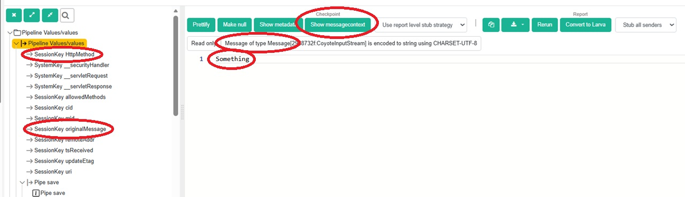
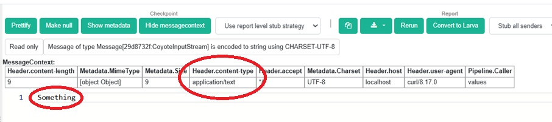

.. _advancedDevelopmentValues:

Values
======

Section :ref:`properties` explained properties, name/value pairs that can be referenced in Frank configurations. Properties typically come from outside a Frank configuration or from properties files added to a project. This section zooms out and considers other types of values and the way they are used to manipulate data.

The following ``Configuration.xml`` is used to explain this material:

.. literalinclude:: ../../../../src/Frank2Values/configurations/Values/Configuration.xml
   :language: xml
   :linenos:

This configuration has an ``<ApiListener>`` and hence it receives HTTP requests. Let us consider that the following request is sent to it (with curl):

.. code-block:: none

   curl -i -X POST -H 'Content-Type: application/text' http://localhost/api/values -d 'Something'

When we open the resulting Ladybug report, we see the following:

We see here the start checkpoint of the pipeline. To the bottom-right, the message of this checkpoint is shown: ``Something``. Below the selected checkpoint you see *session keys*, for example ``httpMethod`` (value is ``POST``) and ``originalMessage``. Session keys act as variables that can hold the same kind of data as the message flowing through the pipeline. The Frank!Framework stores the incoming message in session key ``originalMessage``. This is useful because many pipes produce an output message that differs from the input message. This session key allows downstream pipes to access the original input message. Session keys can be written with a ``<PutInSessionPipe>`` as shown in line 10 (this pipe is only added to show how to write session keys; it is superfluous because ``originalMessage`` is filled automatically with the same value).

The default input message of the first pipe is the pipeline's input message while any other pipe uses the previous pipe's output message as input by default. This can be overridden using attributes ``getInputFromSessionKey`` or ``getInputFromFixedValue`` to use a session key or a fixed value instead. These attributes are defined by ``AbstractPipe``, a Java superclass of many (or all?) pipes, see the Frank!Doc.

Messages or session keys are treated as strings by default but they also carry additional data, namely *context keys*. The context keys can be shown in Ladybug using the "Show messagecontext" button. This is not to be confused with the "Show metadata" button. That button shows metadata calculated by Ladybug that cannot be used within Frank configurations. Here is the message context of the input message:

In addition to the text ``Something`` this message has key/value pairs. The ``<ApiListener>`` that captured this object has added the HTTP headers as context keys, for example ``Header.content-type`` with value ``application/text``. That context key captures the content type we supplied through ``curl``: ``-H 'Content-Type: application/text'``.

The ``<ReplacerPipe>`` shown in lines 11 -- 13 of ``Configuration.xml`` shows how data can be manipulated. Values are often fetched through ``<Param>`` tags and then referenced using the syntax ``?{ ... }``. Mind the question mark: syntax ``${ ... }`` references properties. The ``<ReplacerPipe>`` is capable of replacing a text provided through the ``find`` attribute but does not do so when that attribute is omitted. Then the resulting pattern ``Property value ${my.property} and parameter value ?{my.param}`` is transformed ty substituting the property and the parameter. The output is: ``Property value My property value and parameter value My parameter value``, the result of substituting the property and the parameter. In the example, the property was defined in ``DeploymentSpecifics.properties``.

Finally, lines 14 -- 16 show a way to read a context key. Only the ``<Param>`` element is able to obtain the value. Then the parameter has to be referenced to get the value from the pipe. The output is ``application/text``.

.. NOTE::

   The ``<EchoPipe>`` does not substitute parameters, only properties.
