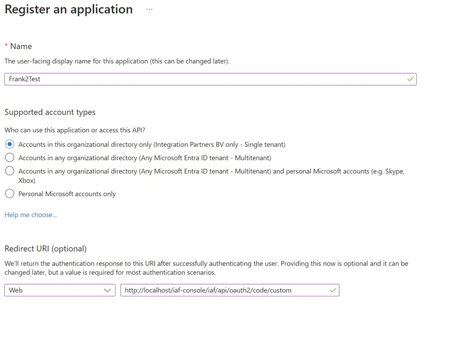
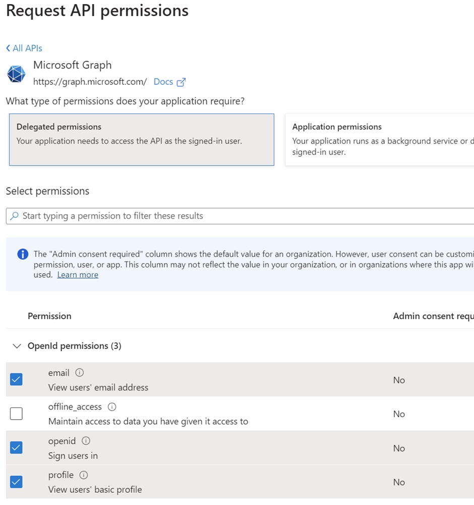
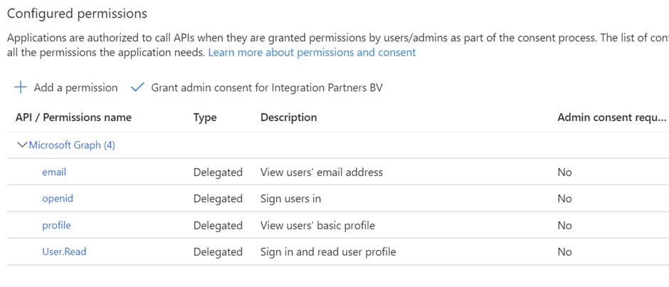
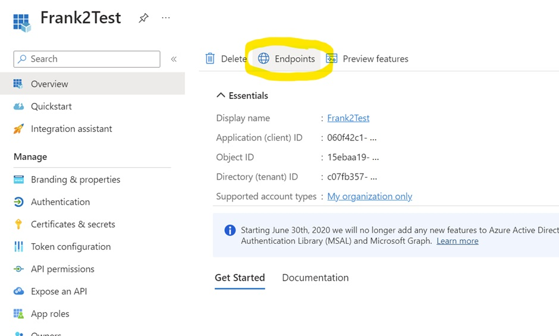

  .. WARNING::

     This page is still work in progress.

.. _deploymentMicrosoftEntraId:

Protecting the Frank!Console with OAuth provider Azure AD
=========================================================

This section explains how to protect the Frank!Console with OAuth 2.0 from OAuth provider Azure AD. Before you can apply these instructions, you need to have a license for Microsoft Azure.

The basic idea of OAuth is that the user does not log in to the application (i.e. the Frank application) directly. When a user wants to access the application, he is redirected to a login page of Microsoft Azure. After successful login, the Frank!Framework receives a token. The Frank!Framework thus does not manage user credentials: checking whether the user provides the correct credentials is delegated to Microsoft Azure.

When a user is redirected to Azure AD by the application, the application is represented by an id, the *client id*. The application with the specified client id wants permission to access specific user data or to perform specific actions on behalf of the user. OAuth uses the term *scope* for each specific data item or each specific action. In the Azure AD user interface, scopes are shown with heading "OpenId permissions". Another synonym for scope is *claim*. To summarize, when an application logs in to Microsoft Azure AD on behalf of a user, the application wants permissions to access specific scopes for the user.

When a system administrator wants to protect access to a Frank application with OAuth and provider Azure AD, he has to perform the following steps:

* Register the application with Microsoft Entra ID.
* Create the client secret.
* Map OAuth scopes to Frank!Framework roles (authorization).
* Configure the properties in the Frank!Framework that govern authorization.

Registering with Microsoft Entra ID
-----------------------------------

Go to https://portal.azure.com. Go to "Enterprise Applications" | "All applications". Click "Register". Fill out the screen shown below:

Find your newly created application. Configure group to claim mappings. Continue by configuring the claims (scopes):

* Click on "App registrations".
* Find your newly created application.
* Click "API Permissions".
* Go to "Add a permission" | "Microsoft Graph".
* Select "Delegated permissions". See the screenshot below:

After saving your changes, it should look like this:

.. WARNING::

   The instructions shown so far grant each user the same scope(s). If you want more fine-grained access, you need to create ACLs in Azure Entra ID. See the following Microsoft article for more info: https://learn.microsoft.com/en-us/entra/identity-platform/howto-add-app-roles-in-apps.

Creating a Client Secret
------------------------
At this point, you have configured in Azure ID what scopes will be accessible by the application for the user. The final step of registering the application is to generate a *client secret*. Continue as follows:

* Go to "Certificates & Secrets".
* Go to "New client secret" and enter a client secret.
* Save the secret value, you'll need this later.

See the following image for more info:

Mapping OAuth scopes to Frank!Framework roles (authorization)
-------------------------------------------------------------

You have configured Azure to grant OAuth scopes to logged-in users. You also need to map scopes to Frank!Framework roles before a user can authorize himself with a Frank application. To do this, create file ``oauth-role-mapping.properties`` on the classpath. Here is an example:

.. code-block::

   IbisAdmin=${IbisTester}
   IbisDataAdmin=${otherProperty}
   IbisTester=SCOPE_openid

This example shows the following. Scope ``SCOPE_openid`` means that a user is logged in. The third line links this to Frank!Framework role ``IbisTester``, so when a user has logged in via Microsoft Azure AD then he has Frank!Framework role ``IbisTester``. The first line shows that a Frank!Framework role acts as a property that has the OAuth scope as value. When a user logs in, he also becomes ``IbisAdmin``. The second line shows that scopes can be property references; the value of property ``otherProperty`` is the scope linked to ``IbisDataAdmin``.

Configuring the Frank!Application by setting properties
-------------------------------------------------------

The following properties have to be set in the Frank!Framework. They configure the Frank!Console so that its users should authenticate themselves at identity provider Azure AD. Use them on the class level (``src/main/resources`` or ``classes``) or as system properties.

.. code-block:: none

   application.security.console.authentication.type=OAUTH2
   application.security.console.authentication.provider=custom
   #Directory (tenant) ID
   application.security.console.authentication.clientId=<application id>
   #Secret value
   application.security.console.authentication.clientSecret=
   application.security.console.authentication.scopes=openid,profile,email
   application.security.console.authentication.authorizationUri=https://login.microsoftonline.com/<tenantID>/oauth2/v2.0/authorize
   application.security.console.authentication.tokenUri=https://login.microsoftonline.com/<tenantID>/oauth2/v2.0/token
   application.security.console.authentication.jwkSetUri=https://login.microsoftonline.com/common/discovery/v2.0/keys
   application.security.console.authentication.issuerUri=https://login.microsoftonline.com/<tenantID>/v2.0
   application.security.console.authentication.userInfoUri=https://graph.microsoft.com/oidc/userinfo

.. NOTE::

   At the top of this list, you see ``application.security.console.authentication.provider=custom``. For other OAuth providers than Microsoft Azure AD, some of the values shown above are fixed. For example, when you set ``application.security.console.authentication.provider=google``, some of these properties can be omitted. Detailed information will be added to this manual later.
