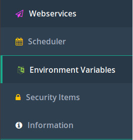

.. _deploymentProperties:

Properties 
==========

Properties are key/value pairs, both the key and the value being strings. There are
different ways to set properties, which is the subject of section
:ref:`deploymentConfigureProperties`. This section focuses on the impact of
setting properties. First, any string can be used as a property name and its value can be
used within a Frank. Second, some 
properties also change the way the frank!framework operates.

Properties in Frank configurations
----------------------------------

Any string can be used as a property name. Consider
for example the following adapter:

.. code-block:: XML

   <Adapter name="AccessProperties">
     <Receiver name="receiverAccessProperties">
       <JavaListener name="listenerAccessProperties" />
     </Receiver>
     <Pipeline firstPipe="accessProperties">
       <Exit state="success" path="Exit" />
       <FixedResultPipe name="accessProperties"
           returnString="From stage ${otap.stage}, I say ${my.text}" >
         <Forward name="success" path="Exit" />
       </FixedResultPipe>
     </Pipeline>
   </Adapter>

The ``<FixedResultPipe>`` outputs a fixed string that is configured
in attribute ``returnString``. The value of this XML attribute
contains the substrings ``${otap.stage}`` and ``${my.text}``.
These substrings reference the values associated with keys "otap.stage"
and "my.text". The way to assign values to properties is described in section
:ref:`deploymentConfigureProperties`. A possible output of this pipe is: ::

  From stage LOC, I say My text is Hello

Property values can be viewed in the console of the frank!framework. On
the menu on the left, go to "Environment Variables":

Note that property "my.text" has no special meaning for the
frank!framework. Setting it has no other impact than changing
the output from this adapter (or possible other adapters
that reference it). This is different for property "otap.stage"
as is explained in the next subsection.

Configuration properties of the frank!framework
-----------------------------------------------

Here follows a list of properties with a predefined meaning:

log.dir
  The value of this property is the directory to which the frank!framework
  writes its log files.

log.level
  Defines how much log lines are produced by the frank!framework. The most
  log lines are produced with value "DEBUG", while less
  are produced with "INFO", less with "WARN" and the least
  with "ERROR". The value is case insensitive.

jdbc.convertFieldnamesToUppercase
  Can be "true" or "false" (the default). When true, all field names and
  table names of a database are automatically converted to upper case. For example,
  a query "SELECT id FROM booking" is interpreted as "SELECT ID FROM BOOKING"

jdbc.migrator.active
  Can be "true" or "false" (the default). When true, database initialization
  is switched on. The default behavior is to do this with LiquiBase, see 
  https://www.liquibase.org/. With LiquiBase, the file
  "classes/DatabaseChangelog.xml" in your project directory is executed.

otap.stage
  Defines the DTAP stage of this deployment. Possible values are "LOC",
  "DEV", "TST", "ACC" and "PRD". These values are case insensitive. The
  value determines whether additional properties are read from file
  "StageSpecifics_LOC.properties" or "StageSpecifics_DEV.properties" or
  ... or "StageSpecifics_PRD.properties". See section
  :ref:`deploymentConfigureProperties` for more details on how properties
  are read.

