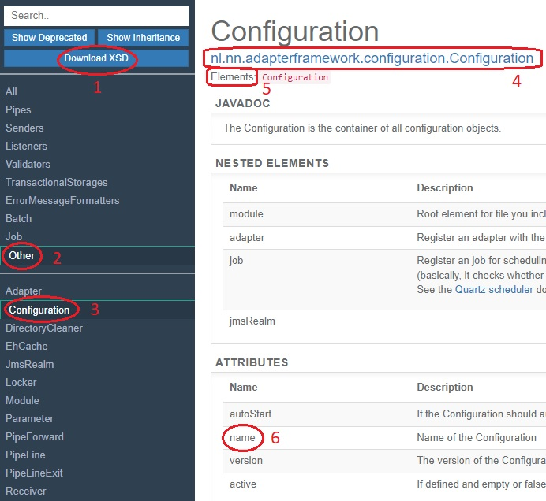
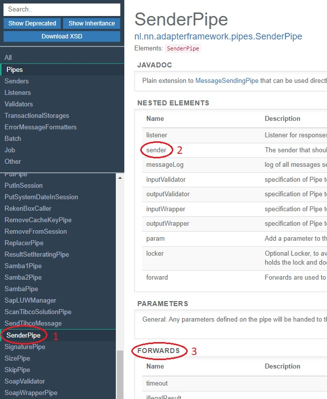

.. _helloIbis:

Hello World Source Code
=======================

Introduction
------------

In the previous section you installed the Frank!Runner, a tool to quickly start the Frank!Framework. You saw the directory structure resulting from this installation. There was subdirectory ``configurations`` with subdirectories ``Example1a`` and ``Example1b``, which are deployed Frank configs. These directories contain files with extension ``.xml`` and files with extension ``.properties``. XML stands for Extensible Markup Language, see https://www.w3.org/XML/. Property files are text files that contain name/value pairs. In this section you start learning how to write these files.

The configurations Example1a and Example1b that you encountered in the previous section are almost the same. You will examine the ``Configuration.xml`` of Example1a. It reads as follows:

.. code-block:: XML

   <Configuration 
     xmlns:xsi="http://www.w3.org/2001/XMLSchema-instance"
     xsi:noNamespaceSchemaLocation="../FrankConfig.xsd"
     >
     <Adapter name="Adapter1a">
       <Receiver name="Receiver1a">
         <ApiListener name="Listener1a" uriPattern="service1a"/>
       </Receiver>
       <Pipeline>
         <Exit path="EXIT" state="SUCCESS"/>
         <FixedResultPipe name="HelloWorld" returnString="Hello World!">
           <Forward name="success" path="EXIT"/>
         </FixedResultPipe>
       </Pipeline>
     </Adapter>
   </Configuration>

Frank configuration
-------------------

The outer part of ``Configuration.xml`` reads:

.. code-block:: XML

   <Configuration 
     xmlns:xsi="http://www.w3.org/2001/XMLSchema-instance"
     xsi:noNamespaceSchemaLocation="../FrankConfig.xsd"
     >
     ...
   </Configuration>

You see that an XML schema file ``FrankConfig.xsd`` is referenced. This file describes the syntax of Frank configurations. It prescribes which XML elements are allowed and what attributes they can have. Some text editors including Visual Studio Code and Eclipse can flag syntax errors. They can also provide automatic code completion. Finally, they can show information about the meaning of the elements and attributes you are using. This information is included in the XSD. The Frank!Runner takes care of downloading ``FrankConfig.xsd`` and putting it in the right directory. Please note the relative path ``../FrankConfig.xsd``. This path references ``FrankConfig.xsd`` from the parent of the directory where ``Configuration.xsd`` resides.

More reference information can be found in the Frank!Doc, which you can access through the main menu (see previous section). Here is a screenshot:

There is a button to download ``FrankConfig.xsd`` manually (number 1). You may need it if you are not using the Frank!Runner. To understand the Frank!Doc, you need to know that each XML element that you can use corresponds to a Java class in the source code of the Frank!Framework (publicly available on `GitHub <https://github.com/ibissource/iaf>`_). For your convenience, we have divided these Java classes in groups. You can select a group in the top-left menu (number 2). Then you can select a Java class in the bottom-left menu (number 3). To the right, you see information about the Java class. You have the full name of the Java class (number 4). You see what XML elements you can use to reference the class (number 5). In the case of Java class ``Configuration``, the only way to reference it is ``<Configuration>``, but there are Java classes that can play different roles within a configuration. Such Java classes have multiple XML elements.

You see that a ``<Configuration>`` element can have a ``name`` attribute (number 6). This attribute has not been set, because the directory name has been used by the Frank!Framework to name the configuration. If you structure your configurations in a different way, you may have to set the ``name`` attribute for your configuration.

Adapter
-------

When we examine the contents of the ``<Configuration>`` tag, we find the following:

.. code-block:: XML

   ...
   <Adapter name="Adapter1a">
     <Receiver name="Receiver1a">
       ...
     </Receiver>
     <Pipeline>
       ...
     </Pipeline>
   </Adapter>
   ...
   
An adapter is a service that is triggered by a receiver and executes a pipeline in response. It can be compared to a subroutine in programming languages. The receiver defines how the input message is obtained. The pipline defines how the input message is processed. The pipeline produces an output message that may be used by the receiver to produce a response. The ``<Receiver>`` tag configures the receiver and the ``<Pipeline>`` tag defines the pipeline. 

Receiver
--------

Our receiver reads:

.. code-block:: XML

   ...
   <Receiver name="Receiver1a">
     <ApiListener name="Listener1a" uriPattern="service1a"/>
   </Receiver>
   ...

It has name ``Receiver1a``. Its further definition is provided by the tag within: ``<ApiListener>``. Listeners
are building blocks that accept input. The choice for ``<ApiListener>`` means that the adapter "Adapter1a" listens to
RESTful HTTP requests and that the HTTP endpoint should be described in an OpenAPI Specification (see `<https://swagger.io/specification/>`_).

There are other listeners, for example ``<JavaListener>`` and ``<DirectoryListener>``. ``JavaListener`` makes your adapter listen to direct Java calls. ``DirectoryListener`` triggers your adapter when a file is added to a chosen directory on a (server-side) local file system. The Frank!Doc has a group that contains all listeners.

Pipeline
--------

The pipeline defines how the message provided by the receiver should be processed. It reads:

.. code-block:: XML

   ...
   <Pipeline>
     <Exit path="EXIT" state="SUCCESS"/>
     <FixedResultPipe name="HelloWorld" returnString="Hello World!">
       <Forward name="success" path="EXIT"/>
     </FixedResultPipe>
   </Pipeline>
   ...

A pipeline is a network of pipes. Pipes are predefined functions that can be performed on the incoming message. The ``<FixedResultPipe>`` ignores the input and outputs a fixed string that can be configured. The fixed output string we want is in the ``returnString`` attribute. In the remainder of the :ref:`gettingStarted` chapter, we will see pipes with more interesting functions, like applying XSLT transformations and sending data to a database. The Frank!Doc has a group "Pipes" that holds all available pipes. The ``<Exit>`` tag defines a state in which processing can end. In our case, we have one state that we name "success". It can be referenced from pipes by its path "EXIT".

The ``<Forward>`` within a pipe tag defines what should happen after the execution of that pipe. A forward consists of a forward name and a path. Each pipe predefines the forward names from which it can send the output. For the fixed result pipe, the only possibility is "success", but many pipes also have the possibility "failure". This allows Frank developers to handle errors and to have branching pipelines. The ``<Forward>`` tag within the ``<FixedResultPipe>`` references the path "EXIT", which is the path of the ``<Exit>`` tag. The output of the ``<FixedResultPipe>`` is the result of the pipeline. In more complex pipelines, there are also forwards that reference other pipes by their configured ``name`` attribute. It is also possible to have multiple ``<Exit>`` tags within a ``<Pipeline>``.

The shown example pipeline only transform the incoming message to an output message, but you can also send output to external systems. Please see the following screenshot of the Frank!Doc:

When you want to send data to an external system, you use pipe ``<SenderPipe>`` (number 1). A ``<SenderPipe>`` can have a sender inside (number 2). When you hover over that word, you get the list of allowed child elements. You can also search senders by selecting group "Senders" in the top-left menu. The choice of the sender and its configuration determine how the input message to the ``<SenderPipe>`` is sent. In section :ref:`insertDb`, you will see that a ``<FixedQuerySender>`` can be used to write data to a database. The figure also shows that the predefined forwards of a pipe are documented (number 3).

Conclusion
----------

You studied a simple adapter that is included as an example within the Frank!Runner. It has a receiver that allows us to trigger it. It has a pipeline with a single pipe that outputs a fixed message. In the next section, :ref:`helloTestPipeline`, we will see this adapter in action and we will learn how to test pipelines.
