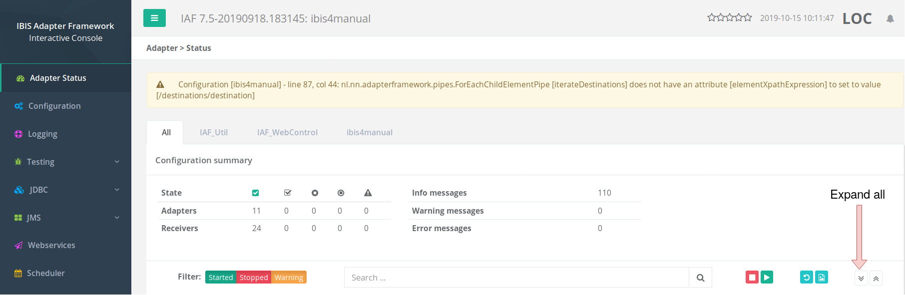

.. _gettingStartedLarva:

Console Larva
=============

This is the final section about the Hello World adapter presented
in section :ref:`helloIbis`. In application development,
it is common to have automated tests. You cannot rely
on interactive testing only, because performing these
takes much more time than running automated tests.
Furthermore, interactive testing is tedious work and
therefore error-prone, especially when the same
tests have to be performed over and over again
for new releases.

The Frank!Framework offers the Larva service that runs
automated tests. To work with Larva, you need a file named
``<project directory>/classes/StageSpecifics_LOC.properties``.
It should contain the line: ::

  stub4testtool.configuration=true

This file tells the Frank!Framework to add stubs for some
receivers and some senders. Details on what stubs are added
exactly are beyond the scope of this Getting Started
guide.

.. NOTE::

   The Frank!Framework internally applies an XSLT stylesheet
   to the original Frank if ``stub4testtool.configuration`` is
   true. You can find it with the source code on GitHub, URL
   http://www.github.com/ibissource/iaf. The file you need
   is ``ibis-adapterframework-core/src/main/resources/xml/xsl/stub4testtool.xsl``.

.. NOTE::

   The properties set in ``StageSpecifics_LOC.properties`` only apply in
   your local development environment. You use other property files
   for properties specific to a DTAP stage. Use ``StageSpecifics_DEV.properties``
   for D, ``StageSpecifics_TST.properties`` for T,
   ``StageSpecifics_ACC.properties`` for A and ``StageSpecifics_PRD.properties`` for P. See sub-subsection :ref:`propertiesDeploymentEnvironmentLogicalCharacteristics` for an explanation of DTAP stages.

You can check what stubs have been created, as follows. Go to the
Adapter Status page and press the expand all button as shown below:

Then enter Ctrl-F in your browser and search for "testtool". You get the
following screen:

.. image:: testtoolHello.jpg

You see here that the HelloDockerWorld adapter presented in
:ref:`helloIbis` now
has two receivers. One of them is named ``testtool-HelloDockerWorld``.

Larva tests are added to the ``tests`` subdirectory of your
project directory. To build a scenario, you need a
properties file <your-scenario-name>.properties within
a parent directory that holds a group of scenarios. To
build a (trivial) Larva test of the Hello World adapter,
you can create the file
``<your-project-directory>/tests/Hello/scenario01.properties``.

Within your scenario, you need a service that writes to
the ``testtool-HelloDockerWorld`` receiver and reads responses
from it. For historic reasons, a service has a name
consisting of two words separated by a dot. You can
choose the service name ``ijs.hello``.

Adding this all together, the following can be written
to ``scenario01.properties``: ::

     scenario.description = Hello world test, made to see how to configure Larva

     ijs.hello.className = nl.nn.adapterframework.senders.IbisJavaSender
     ijs.hello.serviceName = testtool-HelloDockerWorld

The string ``ijs`` is an abbreviation of ``IbisJavaSender``. It is common to name the service after the class name being used. Alternatively, many developers write ``java`` instead of ``ijs``.

The rest is simpler. We have to direct our service to write a
dummy message and read the response back. The read response
is then compared to the expected value we configure. Please append
the following to ``scenario01.properties``: ::

     step1.ijs.hello.write = scenario01/step01.xml
     step2.ijs.hello.read = scenario01/step02.txt

.. NOTE ::

  Although we are formally writing a properties file, it is better
  to see this as a simple programming language. The first of these
  two lines for example should be interpreted as follows. ``step1`` means
  this is the first step in the scenario. ``ijs.hello`` is the service
  name to use, defined earlier to interact with the receiver stub
  ``testtool-HelloDockerWorld``. ``write`` means we want to write data. On the
  other side of the "=" sign, we find a filename that references
  the data we want to write.

Finally, the two files ``tests/Hello/scenario01/step01.xml`` and ``tests/Hello/scenario01/step02.txt``
are needed, the latter holding the expected response from the Hello World adapter and the former holding some
arbitrary XML. Please add these files.

You can run the Larva scenario by pressing the Start button, as shown:

   .. image:: larvaRun.jpg

Your test will succeed if and only if the contents of "step02.txt" is
the same as the ``returnString`` attribute within the Hello World adapter.

This was the last section about the Hello World adapter. The rest of :ref:`gettingStarted`
will consider a more interesting example.
