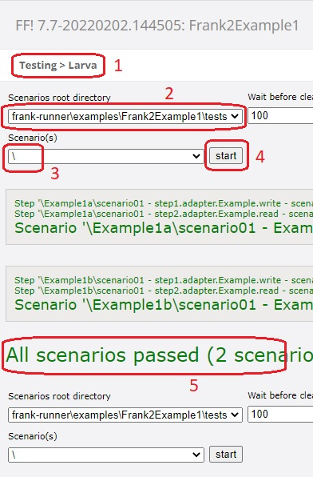
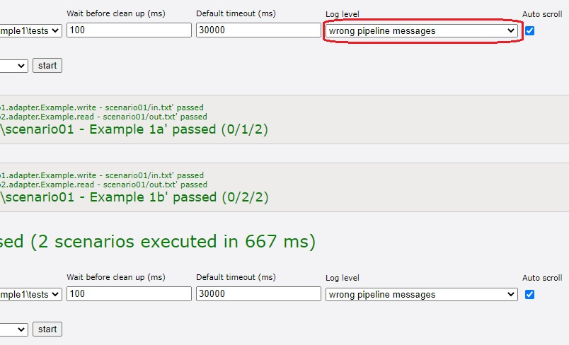
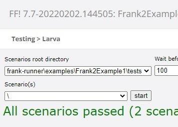

.. _gettingStartedTestPipelines:

Testing Pipelines
=================

This section shows three ways to test and debug your pipeline. First, you can run your pipeline while disregarding its receivers. Second, you can see a detailed report on the way a message has been processed. This is done by our Ladybug debugger. Third, you can run unit tests using our test tool Larva.

Test a Pipeline
---------------

An adapter has receivers to receive messages and a pipeline to transform them. The received message can be accompanied by so-called session keys, which are just name/value pairs. Pipelines can be tested with the Testing | Test a Pipeline option on the main menu as shown below:

.. image:: testPipeline.jpg

You have feedback that you chose that option (number 1). Next, choose an adapter (number 2). Then enter the input message to be transformed by the pipeline (number 3). Usually the input message should be XML. Many pipelines expect XML and produce unexpected errors if the input does not conform the XML standard. It is also possible to enter the message by uploading a file. For text files, the encoding (e.g. UTF-8) has to be specified (field "Encoding", not shown). There is a field called "Session Key" that can be used to add a session key to the message. It is fine to leave that blank.

Next press "Send" (number 4). You see the output message (number 5) and the ``state`` of the exit (number 6).

Ladybug
-------

See the figure below:

.. image:: ladybugSummary.jpg

You can examine your pipeline runs by choosing "Testing | Ladybug" from the main menu. You have feedback that you chose that option (number 1). Next, press "Refresh" (number 2) to update the overview of your runs. The figure shows only one report (number 3). Usually, you can use the "EndTime" and the adapter "Name" columns to find the report you want. Click that row to view it in the bottom-left tree-view. You can expand and collapse the pipeline and the pipes it contains. For each node, you can see the input or output message by selecting it. By selecting number 4, you see the input message of the pipeline. The output message of the pipeline is at node 7. The input and the output of the only pipe, the ``<EchoPipe>``, are at nodes 5 and 6. Information about the chosen node can be seen to the right: number 8 shows the message.

Ladybug has many functions. It is explained in detail in chapter :ref:`ladybug`.

Larva
-----

The figure below shows how to use Larva.

Select "Testing | Larva" from the main menu. You have feedback that you are in Larva (number 1). Then choose the scenarios root (number 2); usually you have only one choice. This is the directory where your tests reside. Then select the tests you want to run (number 3). When you press "Start" (number 4), the selected tests are executed. You see messages about the success or failure of the individual tests and of scenarios (groups of tests). To the end, you see whether all tests have succeeded or whether there are errors (number 5).

There is one additional control in the Larva interface that requires attention; see figure below:

The highlighted drop-down lets you control how much output you want to see. For example, if you change the default value "wrong pipeline messages" to "totals", you get the following when you run your tests:

Larva tests are programmed using properties files. This is explained in section :ref:`testingLarva`.