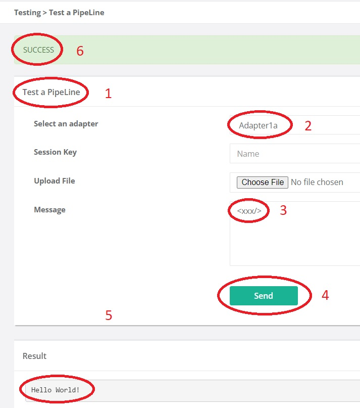
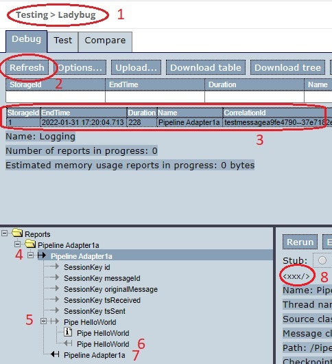

.. _gettingStartedTestPipelines:

Testing Pipelines
=================

This section shows three ways to test and debug your pipeline. First, you can run your pipeline while disregarding its receiver. Second, you can see a detailed report on the way a message has been processed. This is done by our Ladybug debugger. Third, you can run unit tests using our test tool Larva.

Test a Pipeline
---------------

See the figure below:

You can run your pipeline by choosing "Testing | Test a Pipeline" from the main menu. You have feedback that you chose that option (number 1). Next, choose an adapter (number 2). Then enter the input message you want (number 3). Usually the input message should be XML. Many pipelines expect XML and produce unexpected errors if the input does not conform the XML standard. Then press "Send" (number 4). You see the output message (number 5) and the ``state`` of the exit (number 6).

Ladybug
-------

See the figure below:

You can examine your pipeline runs by choosing "Testing | Ladybug" from the main menu. You have feedback that you chose that option (number 1). Next, press "Refresh" (number 2) to update the overview of your runs. The figure shows only one report (number 3). Usually, you can use the "EndTime" and the adapter "Name" columns to find the report you want. Click that row to view it in the bottom-left tree-view. You can expand and collapse the pipeline and the pipes it contains. For each node, you can see the input or output message by selecting it. By selecting number 4, you see the input message of the pipeline. The output message of the pipeline is at node 7. The input and the output of the only pipe, the ``<FixedResultPipe>``, are at nodes 5 and 6. Information about the chosen node can be seen to the right: number 8 shows the message.

Ladybug has many functions. It is explained in detail in chapter :ref:`