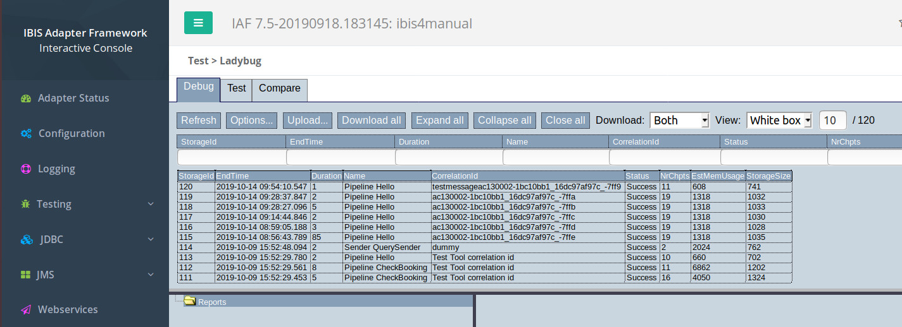

Console Ladybug
===============

The frank!framework offers a strong debugger called Ladybug.
It gives detailed insight of how your message is processed,
because the input and the output of every pipe is shown.
The following picture shows how to access Ladybug:

You see a table that shows all recent moments that your frank
was triggered. When testing, it is wise to remember the time
when you run a test. You should press "Refresh" in Ladybug
and check the time to verify that you are looking to the test
you intend. The top row of the table shows a name field of
"Pipeline Hello".

When you click a row, for example the top row, you see the
corresponding pipeline. After expanding all nodes, you
get the following picture:

.. image:: ladybugTreeview.jpg

The left is a tree view of the pipeline, while the right
gives information about the selected item. This way
you can see all inputs and outputs of all pipes.

.. NOTE::

   In the tree view you see session keys. These are used to
   store information that complements the incoming message, for
   example tsReceived for the time that the input message was
   received (timezone UTC!). For a real REST call (not coming
   from Test Pipeline), you can find an XML with all HTTP
   headers in session key "headers" (not shown).
