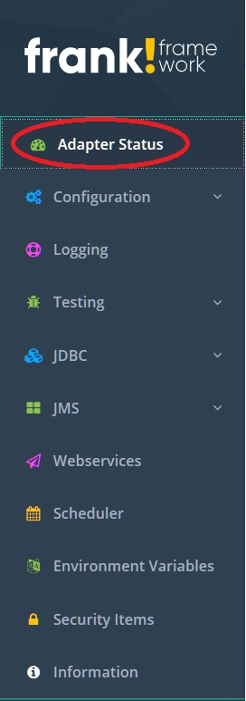
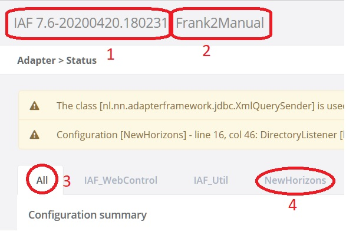
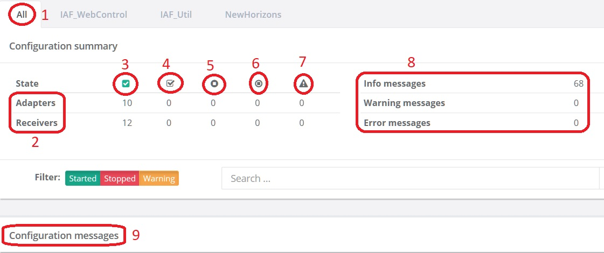
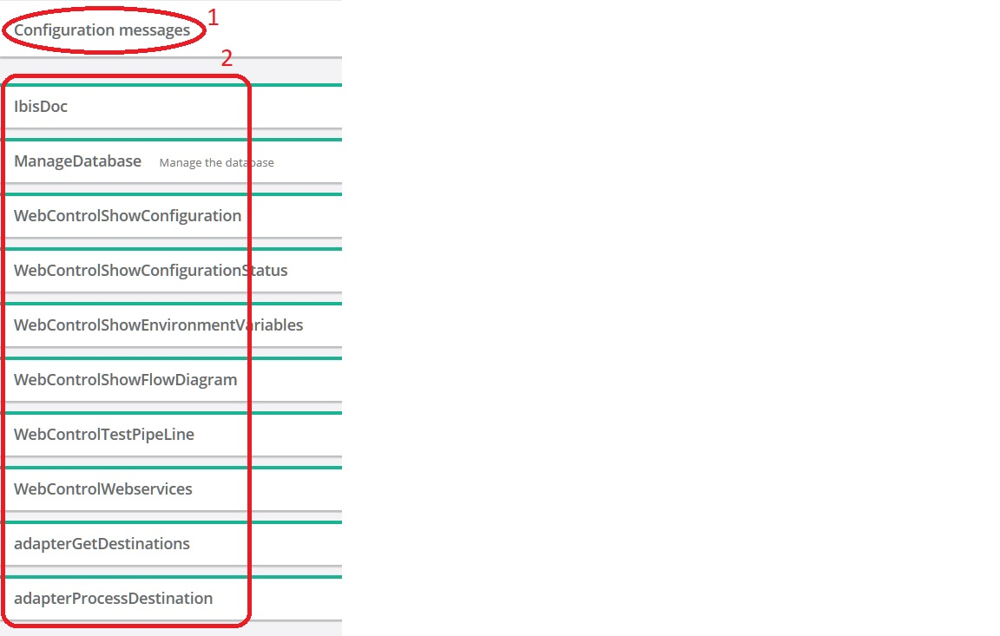
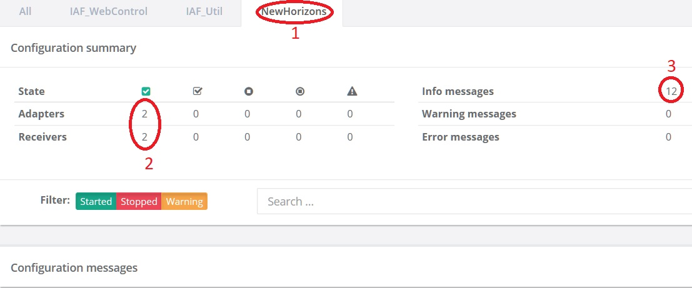
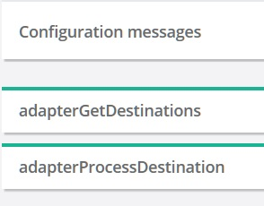
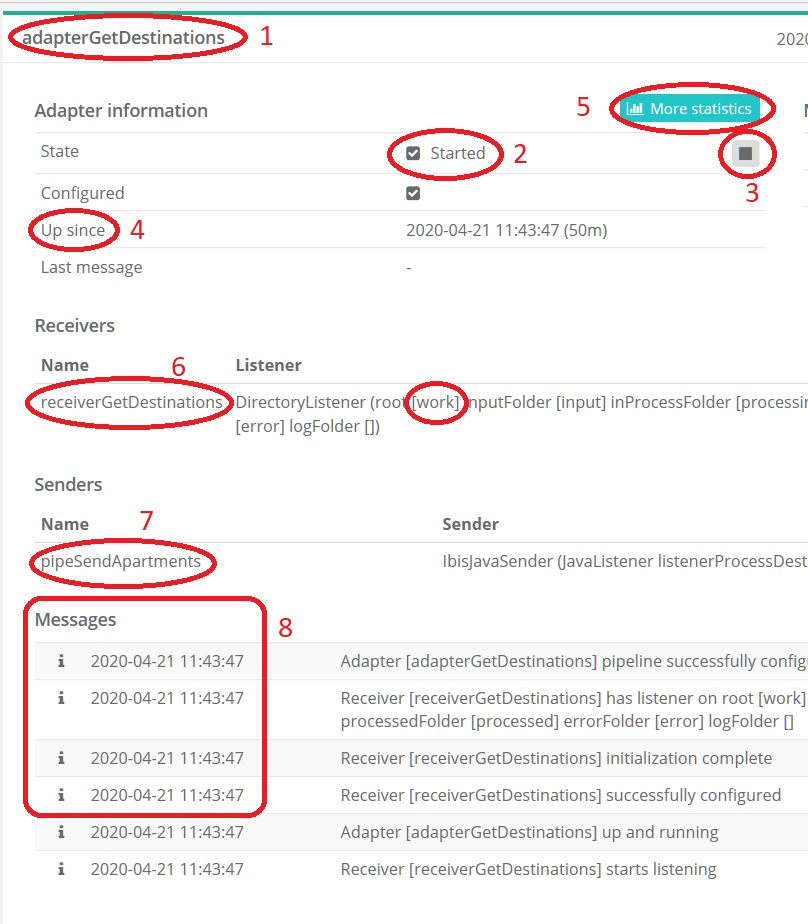

.. _frankConsoleAdapterStatus:

Adapter Status
==============

.. highlight:: none

General
-------

In the previous section :ref:`frankConsolePreparations`, you installed the Frank!Runner and you used it to start the Frank!Framework. You also deployed an example configuration about the imaginary company :ref:`frankConsoleNewHorizons`. In this section, you examine the Adapter Status page, the first page you see when you start the Frank!Runner.

The page is split into two parts. To the left, you see the main menu. The "Adapter Status" item is highlighted, indicating you are on the Adapter Status page, see the picture below:

To the right, you see a dashboard with many different items. To the top-left, you see general information about your Frank!Framework instance as shown below:

You see the Frank!Framework version you are running (number 1) and the instance name of your Frank!Framework deployment (number 2). Within your instance, you can host multiple configurations. Each Frank config has its own tab and there is also a tab "All" (number 3). By default, "All" is selected, indicating that the information below the text "Configuration summary" (not shown) applies to all configurations. There is a tab for the configuration you deployed, "NewHorizons" (number 4), and there are additional tabs for predefined configurations.

Configuration summary
---------------------

Below you see the next section of the Adapter Status page, namely "Configuration Summary". You are still in tab "All" (number 1). This means that the shown data applies to all configurations. We first examine the matrix having its rows annotated with number 2 and its columns annotated with numbers 3 - 7. Number 2 shows the words "Adapters" and "Receivers". A receiver is a building block that gathers messages. These messages are then processed by adapters. Each adapter and each receiver has its own state, which can be "Started" (number 3), "Starting" (number 4), "Stopped" (number 5), "Stopping" (number 6) or "Error" (number 7). Each number within the matrix indicates how many adapters or receivers are in the corresponding state. You see that 10 adapters and 12 receivers have started and that no receivers or adapters are in another state (all zeros).

To the right, you see "Info messages", "Warning messages" and "Error messages", with counts behind them (number 8). These counts summarize the "Configuration messages" panel (number 9). The figure below shows the configuration messages panel (number 1). You see a clickable heading for each adapter (number 2). When you count them, you will see that there are 10 adapters, the number you saw in the matrix of the previous figure. In the previous figure you also saw numbers of configuration messages (number 8). These counted configuration messages are under the ten links of the configuration messages panel (present figure).

Configuration messages
----------------------

Please press the "NewHorizons" tab now, above the text "Configuration summary". The configuration summary panel should change as shown below. You see you selected the "NewHorizons" tab (number 1). You see 2 adapters and 2 receivers (number 2), because you are only seeing Frank config "NewHorizons", not anymore the predefined Frank configs. The number of configuration messages has decreased a lot (number 3).

The configuration messages panel now looks as shown below. You see two adapters as you could expect from the previous figure.

Please click "adapterGetDestinations" now to expand it. The screen should look like shown below. You see it is about adapter "adapterGetDestinations" (number 1). First you see adapter information (numbers 2 - 5) like the state (number 2) and the time since the adapter is up (number 4). You can also stop the adapter (number 3) and get more statistics (number 5).

Next comes information about the receivers feeding "adapterGetDestinations". There is one, namely "receiverGetDestinations" (number 6). There is a button to stop this receiver to the far right of the screen (not shown). When you stop an adapter, all its receivers are stopped as well. When you stop a receiver, the adapter it feeds still keeps running. The effect of this situation will be explained later in this tutorial.

Below the receivers you see the pipes that send output. There is one, "pipeSendApartments" (number 7). Finally you see six messages (number 8). If you open the other adapter you see also six messages. These add up to 12 messages, the number you are seeing in the configuration summary panel. The numbers add because there are no error and no warning messages. If there are error and warning messages, the individual error messages add up to the number of error messages and the same holds for the warnings and the info messages.

Error detection
---------------

You will see now how to detect errors using the Adapter Status page. Please do the following:

#. Stop the Frank!Runner. You can do this by removing the output window or using the ``stop.bat`` script.
#. Remove directory ``franks/frank-runner/work/input``.
#. Start the Frank!Runner as shown before: ``start.bat -Djdbc.migrator.active=true -Dwork=work``.
#. Refresh your browser window.
#. Select tab "NewHorizons". In the configuration summary panel, You should see two adapters in state Started, one receiver in state Started and one receiver in state Error.
#. To the right, you should also see that there is one Error message.
#. In the configuration messages panel, you should see that "adapterGetDestinations" is orange. Please click it to open.
#. In the list of messages, you should have one red message that contains the text "frank-runner\\work\\input". The Frank!Framework complains that this directory is missing.
#. Stop the Frank!Runner.
#. Recreate directory ``franks/frank-runner/work/input``.
#. Start the Frank!Runner again: ``start.bat -Djdbc.migrator.active=true -Dwork=work``.
#. Refresh your browser window. Go to tab "NewHorizons". You should not have any error messages or warning messages now.

   .. NOTE::

      When you restart the Frank!Framework, messages from earlier runs of the Frank!Framework are not shown and not counted anymore.

#. Open a text editor and fill it with the following contents:

   .. literalinclude:: ../../../srcSteps/forFrankConsole/v500/example.csv

#. Save the text to file ``franks/frank-runner/work/input/example.csv``.
#. In the configuration messages panel, open adapter "adapterGetDestinations". From the figure below, you see that a message has been processed.

   .. image:: adapterStatusMessageProcessed.jpg

#. Create file ``franks/frank-runner/work/input/example2.csv`` with contents ``xxx``. This file is processed immediately when it appears, so save only once or copy from another file.
#. Now look at the Frank!Console. The Frank!Framwork has detected an error because the configuration summary panel shows error messages. You can see these messages in the configuration messages panel by opening the two adapters of the NewHorizons configuration. All errors are about file ``example2.csv``. This is invalid input.

.. WARNING::

   No adapter and no receiver has entered state Error. Not everything that goes wrong is reflected in the Started / Starting / ... / Error statusses. To monitor your site, please monitor both the statusses and the messages.

Frank developers should take care to include error handling in their work. Before accepting a configuraion for production, you should have its unhappy flows tested, making sure that errors are detected and become visible in the Adapter Status page.

The next sections give you a short introduction to debugging. This information will help you to cooperate with Frank developers.