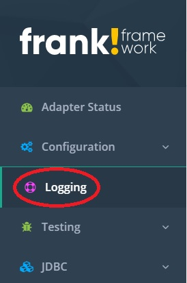
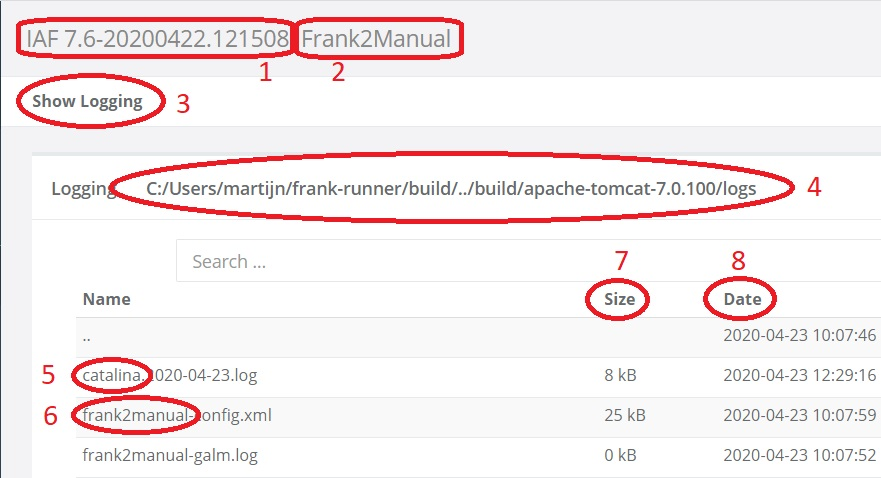

.. _frankConsoleLogs:

Logs
====

Introduction
------------

In section :ref:`frankConsoleAdapterStatus`, you learned how to monitor the general state of the Frank!Framework. In section :ref:`frankConsoleLadybug`, you learned about the Ladybug debugger. Ladybug produces test reports. A test report is a tree view, and each time you open a node, you see more details on the way the incoming message was processed. The present section provides an additional source of information you can use for monitoring and debugging. The Frank!Framework produces many messages during its operation that are written to text files with extension ".log". These are the logfiles, the subject of this section.

To follow the instructions of this section, you should first have done section :ref:`frankConsoleAdapterStatus`. In particular, you should have processed files ``example.csv`` and ``example2.csv``. You should still have the Frank!Runner open.

General information
-------------------

In the main menu, please click "Logging" as shown below:

Your screen should look like shown below. You see the version of the Frank!Framework you are using (number 1), like you do in every screen of the Frank!Console. You also see the instance name of your deployment (number 2). You see confirmation that you are looking at the logging (number 3). All logfiles appear in the same directory on the server and the full path of this directory is shown (number 4).

Below this general information, a directory listing follows. To the top of this listing, you see a file with prefix ``catalina`` (number 5). The name ``catalina`` is used by Apache Tomcat, the application server on which the Frank!Framework is deployed. Apache Tomcat is used under the hood when you use the Frank!Runner, like you are doing in this tutorial. The contents of the ``catalina`` files equals the output you see when you start the Frank!Framework: on Windows, look at the new command window that is created when the Frank!Runner boots. If your production site is not set up using the Frank!Runner, you may be using aother application server. In that case there are no ``catalina`` files. More information on the role of the application server can be found in chapter :ref:`deploying`.

There are also files with prefix ``frank2manual`` (number 6). This name is derived from the instance name of your deployment, which is "Frank2Manual" (number 2). On your production site, you will probably use another instance name, resulting in another prefix. The general rule is that the capitals in the instance name are replaced by lower-case letters to get the prefix. The files with prefix ``frank2manual`` are written by the Frank!Framework, not by the application server on which the Frank!Framework has been deployed.

In the figure, you also see that the file size is shown (number 7). This information is quite relevant, because some logfiles can grow very rapidly. During your career, you will probably see problems caused by full disks. Later in this manual you will see instructions on how to limit the size of your logfiles. Finally, you see a date column (number 8). This is the last date that the file was written, but this date is not updated in real time. To update the modification dates, you have to refresh your browser. Seeing the modification date in the directory listing simplifies searching a lot, because the same information is often spread over multiple logfiles. When you are searching for a specific time, you can quickly see which file to open.

Log rotation
------------

Here are a few logfiles that were present when this manual page was written:

* catalina.2020-04-23.log
* frank2manual-heartbeat.log
* frank2manual-messages.log
* frank2manual.log
* frank2manual_xml.log
* frank2manual_xml.log.1

You see that the filename "catalina.2020-04-23.log" contains a date. No more text is written to this file when April 23 2020 ends. On April 24, a new file "catalina.2020-04-24.log" will be written, etc. You also see "frank2manual_xml.log.1". This file was created because "frank2manual_xml.log" became too large. When the size of "frank2manual_xml.log" passed a certain threshold, it was copied to "frank2manual_xml.log.1". Then "frank2manual_xml.log" was recreated to hold the additional text. When "frank2manual_xml.log" would again grow beyond the threshold, file "frank2manual_xml.log.1" would be copied to "frank2manual_xml.log.2" and then "frank2manual_xml.log" would be copied to "frank2manual_xml.log.1". Then "frank2manual_xml.log" would be recreated to hold the additional data. This approach is called log rotation.

In the remainder of this section, you will examine "frank2manual-heartbeat.log", "frank2manual-messages.log" and "frank2manual.log".

Heartbeat
---------

First we examine "frank2manual-heartbeat.log". Every line has the same syntax. You can understand this file by looking only at the first two lines. They read:

.. code-block:: none

   2020-04-23 10:07:59,210 INFO adapter [WebControlShowConfigurationStatus] has state [Started]
   2020-04-23 10:07:59,211 INFO receiver [WebControlShowConfigurationStatus] of adapter [WebControlShowConfigurationStatus] has state [Started]

Both lines start with a timestamp, the time to which the message applies. Then comes the word "INFO". This is the log level. In the heartbeat file you only have log level "INFO", but in other logfiles it can be "DEBUG", "INFO", "WARN" or "ERROR". You can configure the minimum loglevel shown in the log files. You can for example have "DEBUG" lines omitted, or both "DEBUG" and "INFO" lines, or you can only have "ERROR" messages. This feature allows you to control the size of your logfiles. For instructions see section :ref:`frankConsoleDiskUsage`.

After the log level, you see "adapter" or "receiver", followed by a name. This is the adapter or receiver to which the reminder of the line applies. Finally, it says "has state [...]". The hardbeat file thus shows the state of each adapter and each receiver. This information is added periodically. You have snapshots of the adapter status matrix, the left part of the configuration summary panel in the Adapter Status page as explained in section :ref:`frankConsoleAdapterStatus`.

You may use the heartbeat file to set up your own monitoring application. Indeed, there are tools on the market that monitor logfiles and produce graphical user interfaces from them, e.g. https://www.splunk.com. For more information, contact `WeAreFrank! <https://wearefrank.nl>`_.

Messages
--------

The file "frank2manual-messages.log" shows all messages that the Frank!Framework receives from the outside world, and it shows all messages it sends to external systems like the database. Here are a few lines to get a feel for the syntax:

.. code-block:: none

   2020-04-23 10:08:49,911 [receiverGetDestinations-listener[1]] Adapter [adapterGetDestinations] received message [SIZE=57B] with messageId [C:\Users\martijn\frank-runner\work\processing\example.csv]
   2020-04-23 10:08:50,027 [receiverGetDestinations-listener[1]] Adapter [adapterProcessDestination] received message [SIZE=191B] with messageId [C:\Users\martijn\frank-runner\work\processing\example.csv]
   2020-04-23 10:08:50,049 [receiverGetDestinations-listener[1]] Sender [senderCheckProductIdExists] class [FixedQuerySender$$EnhancerBySpringCGLIB$$a70f2778] duration [15ms] got exit-state [success]

You can see that every line has a timestamp, but that there is no loglevel. After the timestamp comes a name following by a number between square brackets, for example "receiverGetDestinations-listener[1]". This is the name of the Java thread executing the incoming message. Typically, every new message will result in a new Java thread. When you consider the whole file, you will see that all lines about "example.csv" have thread "receiverGetDestinations-listener[1]" and that all lines about "example2.csv" have thread "receiverGetDestinations-listener[2]" (provided you only did the instructions of section :ref:`frankConsoleAdapterStatus`, nothing more).

Then comes the word "Adapter" or "Sender", followed by a name, e.g. "adapterGetDestinations". This data allows you to relate the line to a spot in your Frank configuration. For example, the string "Adapter [adapterGetDestinations]" points you to an ``<Adapter>`` tag with attribute ``name=adapterGetDestinations``. The structure of your Frank config returns in the Ladybug testreports you get. You can thus relate lines of the messages logfile to test reports in Ladybug.

As an exercise, please do the following:

#. Open logfile "frank2manual-messages.log".
#. Duplicate your browser tab.
#. In your new tab, go to Testing | Ladybug as explained in section :ref:`frankConsoleLadybug`.
#. Compare the two tabs. Can you relate every line in "frank2manual-messages.log" to a node in a Ladybug test report?

Logfile
-------

Finally, we investigate log file "frank2manual.log". Here are a few lines of it:

.. code-block:: none

   2020-04-23 10:07:52,815 INFO  [localhost-startStop-1] null util.AppConstants - Application constants loaded from url [jar:file:/C:/Users/martijn/frank-runner/build/apache-tomcat-7.0.100/webapps/ROOT/WEB-INF/lib/ibis-adapterframework-core-7.6-20200422.121508.jar!/AppConstants.properties]
   2020-04-23 10:07:52,825 DEBUG [localhost-startStop-1] null util.AppConstants - cannot find resource [DeploymentSpecifics.properties] in classloader [WebappClassLoader] to load additional properties from, ignoring
   2020-04-23 10:07:52,834 DEBUG [localhost-startStop-1] null util.AppConstants - cannot find resource [BuildInfo.properties] in classloader [WebappClassLoader] to load additional properties from, ignoring
   2020-04-23 10:07:52,834 DEBUG [localhost-startStop-1] null util.AppConstants - cannot find resource [ServerSpecifics_.properties] in classloader [WebappClassLoader] to load additional properties from, ignoring
   2020-04-23 10:07:52,834 DEBUG [localhost-startStop-1] null util.AppConstants - cannot find resource [SideSpecifics_xxx.properties] in classloader [WebappClassLoader] to load additional properties from, ignoring

Every line starts with a timestamp and with a log level. Then comes information about the Java component issuing the log message. In the first line for example, you see ``[localhost-startStop-1] null util.AppConstants``. This information may be difficult to understand; it is most meaningful to the Java developers who code the Frank!Framework. At the end of the line comes the actual message, describing the event that happened inside the Frank!Framework.

It is not your job as a site owner to understand this log output in detail. It is your job to scan it and to search for the relevant parts. The timestamp you find in every line is your friend. When you know when something interesting happened, you can always find the relevant part of the logfiles by searching for that time. You can also try searching for strings you copy from Ladybug. You typically copy pieces of the logfile and send them to Frank developers, helping them to fix issues with their Frank configurations.

.. NOTE::

   The Frank!Framework is open source. Frank developers with some Java knowledge can examine difficult issues by cloning the Frank!Framework from GitHub. They can search the Java code for strings that appear in a logfile, pinpointing the location in the Java sources where an error occurs. The URL of this GitHub repository is https://github.com/ibissource/iaf.
