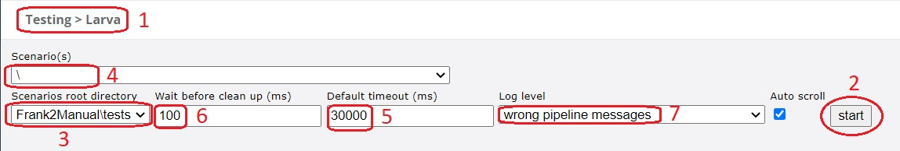

.. _testingLarvaConsole:

Larva console
=============

In sub-subsection :ref:`testingLarvaServicesRunningYourTest` you saw the graphical user interface of Larva. This subsection explains it in more detail. The figure before shows all the elements again:

Below, every numbered element is explained:

1. You are confirmed that you are in Larva.
2. Press this button to run tests.
3. Provides an extra level for grouping scenarios, a scenarios root. To define scenarios root 1, properties ``scenariosroot1.description`` and ``scenariosroot1.directory`` should be defined, the latter being the directory where the Larva scenarios are stored. When you use the Frank!Runner, scenarios root 1 is configured automatically. You can define a scenarios root 2 by defining ``scenariosroot2.description`` and ``scenariosroot2.directory`` or a scenarios root ``<n>`` by defining ``scenariosroot<n>.description`` and ``scenariosroot<n>.directory``. More information about setting properties is available in section :ref:`properties`.
4. You can select here which scenarios you want to run. You can only select scenarios within the chosen scenarios root.
5. Request timeout. If Larva does not receive a response within the specified timeout, then the test is aborted and fails. Default value comes from property ``larva.timeout``, which itself has default 30000 ms.
6. Messages can be written asynchronously. When Larva has finished writing all messages, it can still be waiting for some responses. By default, Larva waits 100 milliseconds for the response messages to arrive. After this timeout, running the tests is aborted and an error is shown. This field allows you to change this timeout of 100 ms.
7. You can control here how much output you want to see when the tests execute.
