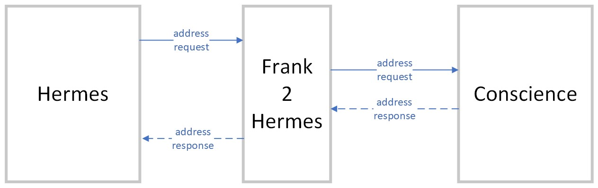
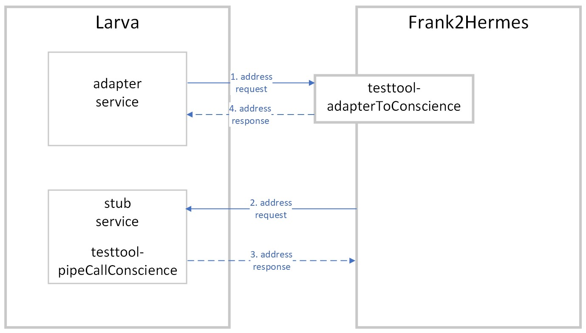

.. _testingLarvaStubbing:

Stubbing
========

This section starts the case study announced at the end of :ref:`testingLarva` and it introduces the concept of stubbing.

Problem description
-------------------

The Rotterdam Bank is a bank that provides current accounts and savings accounts to their customers. The Rotterdam Bank has purchased the Hermes system to send paper statements of account. Hermes comes from an external company. To the Rotterdam Bank it is very important to have the proper contact information of their relations. They have a dedicated department for maintaining this data. The department maintains a system called Conscience to make this data available. Conscience also needs to be accessed by Hermes, because Hermes includes customer addresses in the statements of account.

The problem to be solved is that the interfaces of Hermes and Conscience are not compatible. When Hermes needs an address, it sends out a RESTful HTTP GET request with a body like the following:

    .. literalinclude:: ../../../../srcSteps/Frank2Hermes/v550/tests/hermesBridge/scenario01/hermesAddressRequest.xml
       :language: xml

    **Figure 1:** Hermes address request

Conscience expects a different format. This format looks like the following example:

    .. literalinclude:: ../../../../srcSteps/Frank2Hermes/v550/tests/hermesBridge/scenario01/conscienceAddressRequest.xml
       :language: xml

    **Figure 2:** Concience address request

Conscience produces a response, for example:

    .. literalinclude:: ../../../../srcSteps/Frank2Hermes/v550/tests/hermesBridge/scenario01/conscienceAddressResponse.xml
       :language: xml

    **Figure 3:** Concience address response

But Hermes expects something like this:

    .. literalinclude:: ../../../../srcSteps/Frank2Hermes/v550/tests/hermesBridge/scenario01/hermesAddressResponse.xml
       :language: xml

    **Figure 4:** Hermes address response

The solution
------------

The Rotterdam Bank needs an integration application, or as we say a Frank application, that connects Hermes and Conscience. This integration application is named "Frank2Hermes". Its role is illustrated by the following figure:

Frank2Hermes is a web application that receives address requests. Hermes is configured to send its address requests to Frank2Hermes. When Frank2Hermes receives an address request, it translates the request to the format needed by Conscience. Then this modified request is sent to Consience. The HTTP response from Conscience contains the address, but not in the format needed by Hermes. Frank2Hermes translates the address and then responds that address to the request received from Hermes.

The shown behavior has been implemented in a Frank config "hermesBridge". Please examine this configuration as follows:

#. Download :download:`Hermes Bridge <../../downloads/configurations/hermesBridge.zip>` and deploy it in a development environment that uses the Frank!Runner.
#. Browse to http://localhost. You see the Adapter Status page.
#. Expand "adapterToConscience". You should see the following:

   .. image:: adapterStatusToConscience.jpg

You see that adapter "adapterToConscience" has a receiver (number 1) and a sender (number 2). The receiver is named "receiverToConscience" and it has a listener of type "ApiListener" (number 3). Listener type "ApiListener" means that this receiver listens to RESTful HTTP requests. Hermes should be configured to make HTTP requests that are handled by receiver "receiverToConscience". This receiver both handles the request from Hermes and the response to Hermes.

For the sender, you see the name "pipeCallConscience". This is the name of the pipe that contains the sender. The sender inside this pipe is of type "HttpSender" (number 4). This means that the sender sends HTTP requests. This pipe sends messages to Conscience and receives their response.

You cannot run "adapterToConscience" because there are no implementations of Hermes and Conscience. Even if these systems did exist, it would take time and money to set up a test environment with them. With Larva, you can test this adapter without setting up Hermes and Conscience. In subsection :ref:`testingLarvaServices` you will write a Larva test for "adapterToConscience".

Stubbing
--------

Before you can run a Larva test, you have to get rid of the HTTP interfaces of your adapter. The Frank!Framework can rewrite your adapters to change their interfaces, making them testable with Larva. The Frank!Framework does so if property ``stub4testtool.configuration`` is true. You will now investigate this behavior. Please do the following:

7. Stop the Frank!Runner.
#. Add file ``Frank2Manual/classes/StageSpecifics_LOC.properties`` if it does not exist. Ensure that it has the following line:

   .. literalinclude:: ../../../../srcSteps/Frank2Hermes/v505/classes/StageSpecifics_LOC.properties
      :language: none

   .. WARNING::

      File "StageSpecifics_LOC.properties" has been chosen with care. This property file is only applied in DTAP stage ``LOC``, see subsection :ref:`propertiesInitialization`. It will not be applied in the other DTAP stages, allowing your adapter to work normally in integration tests and on production.

   .. NOTE::

      Setting ``warnings.suppress.sqlInjections.ManageDatabase=true`` is done for the following reason. The Frank!Framework has a build-in adapter named "ManageDatabase". This adapter supplies useful functionality within Larva tests, but its existence raises a security risk. The adapter can process arbitrary SQL that may be entered by a user. In DTAP stage "LOC" this does not matter, because a Frank application is deployed in DTAP stage PRD. We therefore configure the FF! to suppress this warning. The warning is only suppressed in DTAP stage LOC because of the chosen property file name.

#. Restart the Frank!Runner.
#. Expand "adapterToConscience" again. You should see the following:

   .. image:: adapterStatusToConscienceStubbed.jpg

Receiver "receiverToConscience" (number 1) and pipe "pipeCallConscience" (number 2) still exist. A new listener has been added to the receiver. It is of type "JavaListener" (number 3), which means that it can be accessed directly from Java calls. Your test code does not need to prepare a HTTP request to access the receiver. The sender within pipe "pipeCallConscience" has been replaced. The new sender is of type "IbisJavaSender", which means that it calls some Java object through a direct Java call. It is now possible to receive calls from the sender without setting up a web server.

The new listener shows the name "testtool-adapterToConscience". You should reference the listener by this name. The new sender shows the name "testtool-pipeCallConscience". In your test code, you need to define a JavaListener with name "testtool-pipeCallConscience". This JavaListener then becomes the destination accessed by pipe "pipeCallConscience". The modifications of your adapter allow you to test it as shown below:

Your test will take the role of Hermes, sending a request for an address (message 1). The request is sent to the new receiver, so no HTTP request will be needed. The original adapter within Frank2Hermes will still processes the request, but the sender that accesses Conscience will have been replaced. The new sender will access a stub service named "testtool-pipeCallConscience". You will write this stub service. The stub service will receive the Conscience-formatted address request (message 2) and will respond with some Conscience-formatted address (response 3). Frank2Hermes will continue by processing this response. In the end, Frank2Hermes will respond with the Hermes-formatted address (response 4). Your test will finish by checking this response.
