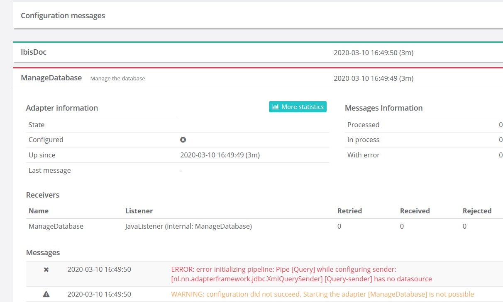
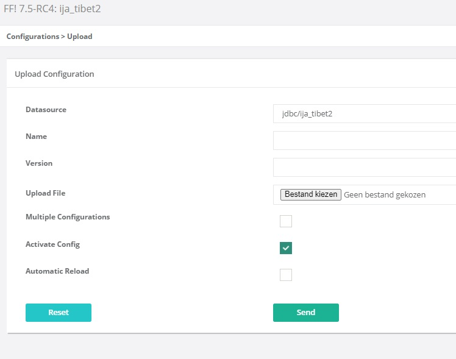

Questions and Answers
=====================

This chapter lists questions and answers about the Frank!Framework.

Adapter status page ManageDatabase error
----------------------------------------

**Question:** Why do I see an error in adapter ManageDatabase, saying that there is no datasource? See below:

**Answer:** You did not add this adapter yourself. This adapter is part of the Frank!Framework. You see here that the Frank!Framework fails to start. This happens when your file names are lowercase. For example, when your files are named ``deploymentspecifics.properties`` and ``configuration.xml`` instead of ``DeploymentSpecifics.properties`` and ``Configuration.xml``, then this error occurs. Correct your file names to fix the issue.

On startup, syntax error in SQL
-------------------------------

**Question:** In the output of the Frank!Runner I see a Java stacktrace of a JdbcSQLSyntaxErrorException, as shown below:

.. code-block:: none

   Caused by: org.h2.jdbc.JdbcSQLSyntaxErrorException: Syntax error in SQL statement "CREATE TABLE VISIT (
                   BOOKINGID INT NOT NULL,
                   SEQ INT NOT NULL,
                   HOSTID INT NOT NULL,
                   PRODUCTID INT NOT NULL,
                   STARTDATE DATE NOT NULL,
                   ENDDATE DATE NOT NULL,
                   PRICE DECIMAL NOT NULL,
                   PRIMARY KEY (BOOKINGID, SEQ)
               )
               ALTER[*] TABLE VISIT ADD FOREIGN KEY (BOOKINGID) REFERENCES BOOKING(ID)"; SQL statement:
   CREATE TABLE visit (
                   bookingId INT NOT NULL,
                   seq INT NOT NULL,
                   hostId INT NOT NULL,
                   productId INT NOT NULL,
                   startDate date NOT NULL,
                   endDate date NOT NULL,
                   price DECIMAL NOT NULL,
                   PRIMARY KEY (bookingId, seq)
               )
               ALTER TABLE visit ADD FOREIGN KEY (bookingId) REFERENCES booking(id) [42000-200]
           at org.h2.message.DbException.getJdbcSQLException(DbException.java:453)
           at org.h2.message.DbException.getJdbcSQLException(DbException.java:429)
           at org.h2.message.DbException.get(DbException.java:205)
           at org.h2.message.DbException.get(DbException.java:181)
           at org.h2.message.DbException.getSyntaxError(DbException.java:229)
           at org.h2.command.Parser.getSyntaxError(Parser.java:1051)
           at org.h2.command.Parser.prepareCommand(Parser.java:741)
           at org.h2.engine.Session.prepareLocal(Session.java:657)
           at org.h2.engine.Session.prepareCommand(Session.java:595)
           at org.h2.jdbc.JdbcConnection.prepareCommand(JdbcConnection.java:1235)
           at org.h2.jdbc.JdbcStatement.executeInternal(JdbcStatement.java:212)
           at org.h2.jdbc.JdbcStatement.execute(JdbcStatement.java:201)
           at liquibase.executor.jvm.JdbcExecutor$ExecuteStatementCallback.doInStatement(JdbcExecutor.java:307)
           ... 35 more

What is wrong?

**Answer:** The SQL statements shown are in ``DatabaseChangelog.xml``. The error says that these statements have syntax errors. The error is in the following snippet of ``DatabaseChangelog.xml``:

.. code-block:: XML

   <changeSet id="2" author="martijn">
       <sql>
           CREATE TABLE visit (
               bookingId INT NOT NULL,
               seq INT NOT NULL,
               hostId INT NOT NULL,
               productId INT NOT NULL,
               startDate date NOT NULL,
               endDate date NOT NULL,
               price DECIMAL NOT NULL,
               PRIMARY KEY (bookingId, seq)
           )
           ALTER TABLE visit ADD FOREIGN KEY (bookingId) REFERENCES booking(id)
       </sql>
   </changeSet>

All SQL within a changeset is interpreted by the database engine. The shown example uses a H2 database, so the SQL dialect of H2 databases is being applied. A ``;`` is needed between the ``CREATE TABLE`` and the ``ALTER TABLE`` statements, right after the closing ``)`` of the ``CREATE TABLE`` statement.

You can see which ``<changeSet>`` has the SQL syntax error. Higher-up in the Java stack trace, there was a line ``Migration failed for change set DatabaseChangelog.xml::2::martijn:``. Here you see it was the change set with id  ``2``.

Passing XML parameter to XSLT
-----------------------------

**Question:** I have an XSLT transformation that expects a parameter of type XML. When I pass the parameter from my Frank config, it is interpreted as a string. How can I fix this?

**Answer:** To execute an XSLT transformation with parameters, you use an ``<XsltPipe>`` with ``<Param>`` tags. Within a ``<Param>`` tag, you can provide the value that will be passed to the XSLT transformation. For passing strings, this is all you have to know; you can find the details in the Frank!Doc. If your value is XML, you need one more trick. Within your ``<Param>`` tag, set ``type="domdoc"``. Here is an example:

.. code-block:: XML

   <XsltPipe
       name="transformHermesMessage"
       styleSheetName="printBridge.xsl"
       omitXmlDeclaration="true"
       xsltVersion="2"
       getInputFromSessionKey="originalMessage">
     <Param
         name="statistics"
         sessionKey="statistics"
         type="domdoc"/>
     <Forward name="success" path="sendToPrintBridge"/>
   </XsltPipe>

Using an Oracle database
------------------------

**Question:** How to use the Frank!Framework with an Oracle database?

**Answer:** You may be used to installing Oracle on your development computer, but this is more complicated than necessary. For example if you have a corporate laptop, you should remember to use the right user account. On a corporate laptop you might have an admin account (WSA account) with administrator rights beside your normal user account. If you log in with your normal account and install Oracle, giving the installer administrator rights, then it does not work. You should log in with your admin account and then install Oracle.
 
You can avoid such issues by using a Docker container for your Oracle database. See the sources of the Frank!Framework for an example. Checkout https://github.com/ibissource/iaf and see directory ``test/src/main/tools/setupDB/Oracle``.

Inserting from XPath expression, default value null
---------------------------------------------------

**Question:** How to insert a table row from an XPath expression while using default value ``null``?

**Answer:** You can use a FixedQuerySender to insert rows in a table. The values to insert are given in ``<Param>`` elements. The value to insert can be given by an XPath expression, for example ``<Param name="myParam" xpathExpression="/BIJKANT/PK/PK_NUMMER"/>``. You cannot use the ``defaultValue`` attribute to use a default value of ``null``, but you do not need to. When you omit the ``defaultValue`` attribute, you will have ``null`` when your XPath expression does not find anything.

Custom logging with log4j
-------------------------

You can write extra logging to (custom) log files using the ``<LogSender>``. When you do not set the logCategory, the message will be appended to the default Ibis4Name.log.
 
Currently the following log categories are available:
 
* ``file`` (ibis4name.log)
* ``XML`` (ibis4name-xml.log)
* ``galm`` (ibis4name-galm.log)
* ``msg`` (ibis4name-messages.log)
* ``security`` (ibis4name-security.log)
* ``heartbeat`` (ibis4name-heartbeat.log)

You can also create additional log categories by configuring a custom ``log4jibis.xml`` in your ``src/main/resources`` (``classes`` folder for non Maven projects) folder.

XSLT Testing with Larva
-----------------------

**Question:** How to test XSLT stylesheets with Larva?

**Answer:** Here is an example:

.. code-block:: none

   scenario.description = adapt input ldap insert into functionally expired passwords
   
   xpl.MaakLdapInput.className   = nl.nn.adapterframework.testtool.XsltProviderListener
   xpl.MaakLdapInput.filename    = ../../../JavaSource/CheckPasswordFunctionalExpired/xsl/AdaptInputLdapInsertIntoPasswordFunctionalExpired.xsl

   step1.xpl.MaakLdapInput.read              = scenario01/step1.xml
   step1.xpl.MaakLdapInput.read.param1.name  = userType
   step1.xpl.MaakLdapInput.read.param1.value = WN
   step2.xpl.MaakLdapInput.write             = scenario01/step2.xml

No adapter restart needed after editing Larva tests
---------------------------------------------------

**Question:** I edited my Larva tests. Do I have to restart the Frank!Runner or reload my configurations?

**Answer:** No. When you edit your Larva tests, you can run them immediately and the Frank!Framework will use the updated files.

Parameters in Larva tests
-------------------------

**Question:** How to pass parameters to Larva services?

**Answer:** You can pass a parameter by referencing the value from a file, or you can put the value directly in your scenario. Here is an example of the latter:

.. code-block:: none

   adapter.TitanGET.param1.name=uniqueIdentifier
   adapter.TitanGET.param1.value=abc

​And here is an example of fetching the value from a file:

.. code-block:: none

   adapter.TitanGET.param1.name=uniqueIdentifier
   adapter.TitanGET.param1.valuefile=01/input.xml

Transaction attribute on receiver or pipeline?
----------------------------------------------

**Question:** Both the ``<Receiver>`` and the ``<Pipeline>`` tag has attribute ``transactionAttribute``. Which element should you choose?

**Answer:** Normally you should choose the ``<Receiver>``. There are two reasons for this. First, the purpose of a transaction is that all data modifications should succeed or none should happen. The ``<Receiver>`` already does part of the work, for example accepting a message from a queue. The second reason is that a pipeline can be fed by multiple receivers. Typically, some receivers support transactions and some do not. If a receivers that supports transactions has the ``transactionAttribute``, the pipeline after the receiver will inherit the transaction. If another receiver does not support transactions, then that receiver does not have a ``transactionAttribute``. In that case, there is no transaction as intended, because there is no ``transactionAttribute`` on the pipeline and the pipeline does not inherit a transaction.

Load multiple configs at once
-----------------------------

**Question:** I have about 20 different jars that I want to upload. How can I use the "Multiple Configurations" checkbox in the "Upload Configuration" screen (see below) to upload them all at once?

**Answer:** Pack all your configuration jar files into a single .zip, check the box and upload the zip file containing all the configurations you would like to upload.

Property configurations.<configname>.parentConfig
-------------------------------------------------

**Question:** What  is the use of the property configurations.<configname>.parentConfig exactly?

**Answer:** It changes the classloading of files and properties. In simpler terms, for every file or property the framework has to load, it will first look it up as a global setting (eq. classpath) then in the local configuration, then (if specified) the parent configuration, and lastly the war (``src/main/resources``). Class loading is described in subsection :ref:`propertiesInitialization`, but that section needs some editing because the phrases "system property" and "classpath property" are used in a confusing way.

Authorization to turn on Ladybug
--------------------------------

**Question:** Which role do you need at least to turn on Ladybug?

**Answer:** IbisDataAdmin, IbisAdmin or IbisTester. IbisDataAdmin might only work in snapshots that include https://github.com/ibissource/iaf/pull/1294 (all after 26-11-2020). See also :ref:`deploymentSecurity`.

Flow diagram images
-------------------

**Question:** The Frank!Console shows flow diagrams of Frank configurations. Where can I find image files of these diagrams?
 
**Answer:** There is a property ``flow.adapter.dir``. It holds the directory where the diagrams are saved as images. The Frank!Framework sets this property automatically. You can find the value of this property by choosing "Environment Variables" from the main menu of the Frank!Console.

XmlSwitchPipe exception "Premature end of file"
-----------------------------------------------

**Question:** Why does ``XmlSwitchPipe`` throw "Premature end of file"?

**Answer:** As the pipe name indicates, it expects the input message to be valid XML. When the input is not in XML format or if the XML is invalid, this error is thrown. You have to configure an XSLT stylesheet that is applied to the incoming message. The pipe uses the result of the transformation as the forward to follow. See also GitHub issue https://github.com/ibissource/iaf/issues/1020.

**Additional:** But with the attribute ``sessionKey``, the XmlSwitchPipe can work without an XSLT transformation, the attribute value being used directly as the forward to follow.

Test ApiListener with authentication (without Larva)
----------------------------------------------------

**Question:** How can I locally test an ApiListener with authentication (without Larva)?

**Answer:** In the configuration, make the authenticationMethod a configurable property (for example ``${​​​​api.authMethod}​​​​​​​​​​​``.
 
In StageSpecifics_LOC.properties, configure:

.. code-block:: none 

   api.authMethod=NONE
   servlet.ApiListenerServlet.securityroles=
 
Liquibase logging
-----------------

**Question:** Where can I find why Liquibase validation failed?

**Answer:** Liquibase will log all errors to the system out error log (SystemErr.log).
