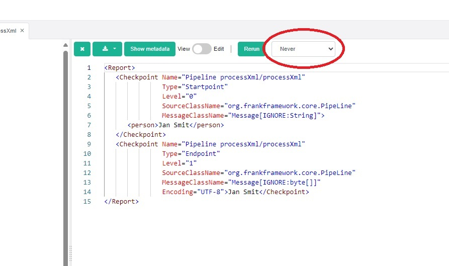
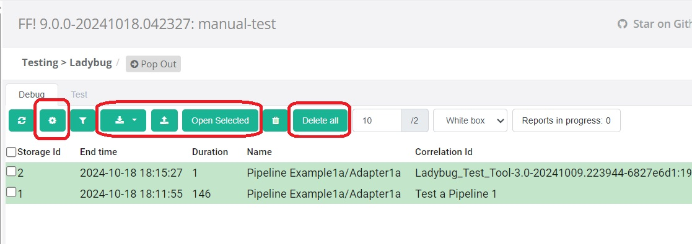
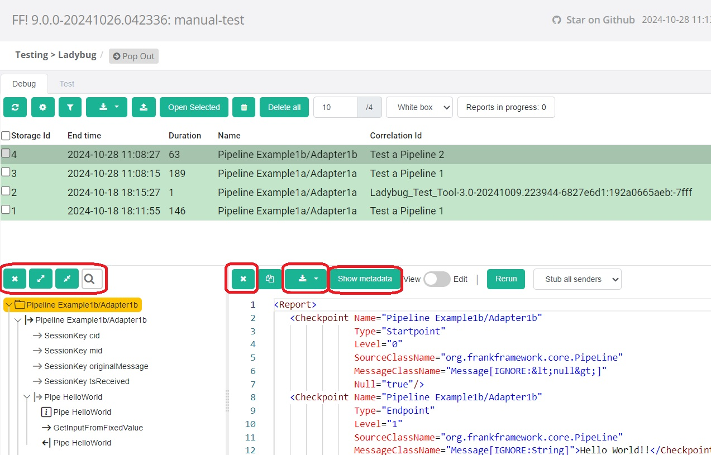
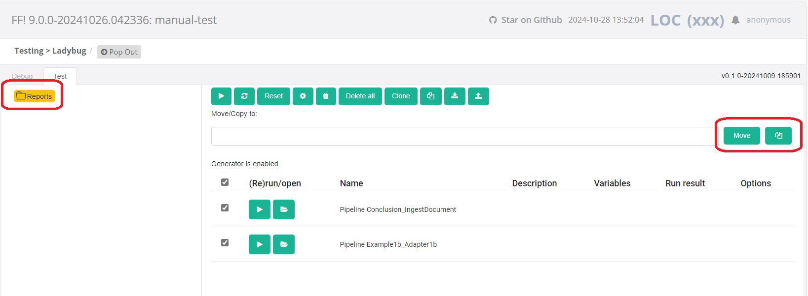

Manual Test
===========

Ladybug is tested by [automated tests](./README.md#cicd). These automated tests do not cover all features of Ladybug. This document presents tests to be done manually. Please perform these tests before making a release of ladybug or a release of [ladybug-frontend](https://github.com/wearefrank/ladybug-frontend).

# Contents

- [Preparations](#preparations)
  - [Checkout](#checkout)
  - [Configure Frank!Runner to run backend - latest code](#configure-frankrunner-to-run-backend-latest-code)
  - [Start up - latest code](#start-up-latest-code)
  - [Configure Frank!Runner to run backend - Nexus release](#configure-frankrunner-to-run-backend-nexus-release)
  - [Start up - Nexus release](#start-up-nexus-release)
- [Tests](#tests)
  - [Test 5: Version numbers](#test-5-version-numbers)
  - [Test 10: Debug tab tree view, layout of checkpoints](#test-10-debug-tab-tree-view-layout-of-checkpoints)
  - [Test 20: Views in the debug tree](#test-20-views-in-the-debug-tree)
  - [Test 30: Authorization](#test-30-authorization)
  - [Test 40: Stubbing](#test-40-stubbing)
  - [Test 50: Toast messages](#test-50-toast-messages)
  - [Test 60: Rerun and compare](#test-60-rerun-and-compare)
  - [Test 70: Low-level error should be shown](#test-70-low-level-error-should-be-shown)
  - [Test 80: Filter debug table](#test-80-filter-debug-table)
  - [Test 90: Miscelaneous tests of debug table](#test-90-miscelaneous-tests-of-debug-table)
  - [Test 100: Persistence of tab contents](#test-100-persistence-of-tab-contents)
  - [Test 110: Miscelaneous tests of the debug tree](#test-110-miscelaneous-tests-of-the-debug-tree)
  - [Test 120: Folder structure of test tab](#test-120-folder-structure-of-test-tab)

# Preparations

The options you have to run ladybug are described in [the readme](./README.md#how-to-change-and-test-ladybug). Here we present more detailed instructions. You some different options about what code you want to test:

* You can test the Nexus release of the Frank!Framework and the ladybug that is included in that release.
* You can test the latest code of the Frank!Framework, ladybug and ladybug-frontend.
* You can test the latest code of the Frank!Framework and ladybug, but use the Nexus release of ladybug-frontend that is referenced in the `pom.xml` of the ladybug backend.

The instructions below make clear what to do for each of these choices.

> [!WARNING]
> The instructions below were mostly executed using a MinGW command
> prompt that emulates Linux. If you use a DOS prompt or PowerShell, please
> use equivalent commands that are valid in your shell instead of literally
> using the shown commands. The exeption is calling `restart.bat`, which you
> probably cannot do in a MinGW command prompt. For readability, all paths
> are shown with `/` as the path separator, even though a DOS prompt uses
> `\`.

Please do the following:

### Checkout

* Create a work directory for performing these tests, say `work`.
* Open a command prompt and change directory to `work`.
* Clone the Frank!Runner, the Frank!Framework, ladybug and ladybug-frontend with the following commands:

  * `git clone https://github.com/wearefrank/frank-runner`.
  * `git clone https://github.com/frankframework/frankframework` (not needed to test Nexus release of FF!).
  * `git clone https://github.com/wearefrank/ladybug` (not needed to test Nexus release of FF!).
  * `git clone https://github.com/wearefrank/ladybug-frontend` (only needed if latest code of ladybug-frontend is tested).
* In directory `work`, check out the versions you want for the F!F and ladybug. You can not choose arbitrarily what vesions to combine. The ladybug backend version used by the FF! is in `work/frankframework/ladybug/pom.xml`, the line `<ladybug.version>...</ladybug.version>` under `<properties>`. That value should be the artifact version mentioned in `work/ladybug/pom.xml`. You can omit this step for now if you want to test the latest ladybug-frontend code.
* If you test the latest code of ladybug-frontend, do the following:
  * Check out the version of ladybug-frontend you want.
  * File `work/ladybug/pom.xml` should be updated to reference the SNAPSHOT version that is in `work/ladybug-frontend/pom.xml`. You can do all updates of `pom.xml` files by running a single ANT script. See `work/frank-runner/specials/util/syncPomVersions/`. If you run this script, no additional manual manipulations of `pom.xml` files are needed.
  * Manually run the Maven build of `work/ladybug-frontend`.

### Configure Frank!Runner to run backend (latest code)

* Change directory to `work/frank-runner/specials/ladybug`.Copy `build-example.properties` to `build.properties`.
* Uncomment line `test.with.iaf=true` in the `build.properties` you created in the previous step. Uncomment some other lines if you want to speed up the build.
* Change directory to `work/frank-runner/specials/iaf-webapp`.
* Copy `build-example.properties` to `build.properties`.
* Search for the line `# configurations.dir=...`. Replace it by `configurations.dir=<path-to-frank-manual>/misc/manual-test/configurations`.
* Uncomment some lines of `build.properties` to speed up the build of the FF!.

### Start up (latest code)

* Change directory to `work/frank-runner/specials/ladybug`. Run the command `./restart.bat`.

### Configure Frank!Runner to run backend (Nexus release)

In this case, the `build.properties` files you have in subdirectories of `work/frank-runner/specials` are not used. Create `work/frank-runner/build.properties` with the following contents:

    # Use this one to allow relative path for project.dir
    # Path given is itself relative to work/frank-runner
    projects.dir=..

    project.dir=<path-to-frank-manual>/misc/manual-test

### Start up (Nexus release)

* Change directory to `work/frank-runner`. Run command `./restart.bat`.

# Tests

### Test 5: Version numbers

**Step 10:** Open ladybug. Check whether the version numbers of the ladybug backend and the ladybug frontend are shown somewhere.

### Test 10: Debug tab tree view, layout of checkpoints

**Step 10:** In the Frank!Framework, use "Test a Pipeline" to run adapter "processXml" with input message `<person>Jan Smit</person>
`.

**Step 20:** In the Frank!Framework, use "Test a Pipeline" to run adapter "processXml" with input message `<person2>Jan Smit</person2>
`.

**Step 30:** In Ladybug, go to the Debug tab. Press the refresh button to refresh the table of reports. Check that the following are true:

* The last two reports have in their "Name" column the value `Pipeline processXml`.
* The second-last report is green to indicate success.
* The last report is red to indicate failure.

**Step 40:** Open the second-last report (the successful one). It should appear in the tree view below the table.

**Step 43:** Check that not the root node of the report but the child node right below that is selected by default.

**Step 46:** Check that at least the following nodes exist with the shown indentation:

* Directory icon `Pipeline processXml`.
  * Right arrow `Pipeline processXml` (selected by default, **step 43**).
    * Right arrow `Pipe validate`.
      * Information `Pipe validate`.
      * Left arrow `Pipe validate`.
    * Right arrow `Pipe getPersonNamePipe`.
      * Information `Pipe getPersonNamePipe`.
      * Right arrow `Sender getPersonNameSender`.
        * Right arrow `Pipeline getPersonName`.
          * Pipe `Pipe applyXslt`.
            * Information `Pipe applyXslt`.
            * Information `./getName.xsl`.
            * Left arrow `Pipe applyXslt`.
          * Pipe `Pipe checkForError`.
            * Information `Pipe checkForError`.
            * Left arrow `Pipe checkForError`.
          * Left arrow `exit state`.
          * Left arrow `Pipeline getPersonName`.
        * Left arrow `getPersonNameSender`.
      * Left arrow `getPersonNamePipe`.
    * Left arrow `Pipeline processXml`.

**Step 50:** Are there nodes in addition to the ones shown in **Step 40**? Are these to be expected?

**Step 60:** Collapse and expand the nodes. Does this look good?

**Step 70:** Click each node and check its value as shown in the pane to the right of the tree. Does each node have a meaningful value?

**Step 100:** In the report table, open the last report (the unsuccessful one). It should appear in the tree view below the table. Check that at least the following nodes exist with the shown indentation:

* Directory icon `Pipeline processXml`.
  * Right arrow `Pipeline processXml`.
    * Right arrow `Pipe validate`.
      * Information `Pipe validate`.
      * Red cross `Pipe validate`.
    * Red cross `Pipeline processXml`.

**Step 110:** Are there nodes in addition to the ones shown in **Step 40**? Are these to be expected?

**Step 120:** Collapse and expand the nodes. Does this look good?

**Step 130:** Click each node and check its value as shown in the pane to the right of the tree. Does each node have a meaningful value?

### Test 20: Views in the debug tree

**Step 10:** Lookup directory `frank-manual/misc/manual-test/configurations/Conclusion/exampleInputs`. If you are testing under Windows, take its Windows path with escaped `\` characters, for example `c:\\Users\\martijn\\git\\frank-manual\\misc\\manual-test\\configurations\\Conclusion\\exampleInputs`, say `<PATH>`. Otherwise, use the Linux path.

**Step 20:** Go to Test a Pipeline and run adapter "Conclusion/Ingest Document". The message should be `<PATH>\\valid` under Windows or `<PATH>/valid` under Linux.

**Step 30:** Go to ladybug and press refresh.

**Step 40:** Open the most recent report from the table (top row) in the debug tree by clicking.

**Step 50:** Check that there is:

* a root node with "Pipeline" in the name;
* another "Pipeline" start node for the pipeline;
* a start node for every pipe;
* input and output points for the session keys;
* a start point for node "Sender sendToMundo" within "Pipe sendToMundo".

**Step 60:** In Ladybug select view "Black box".

**Step 70:** Check that only the following nodes are left:

TODO: Add screen capture, to be made when the black box view works.

TODO: Then continue writing this test.

**Step 200:** Stop the FF!. Under Windows you can do this by pressing Ctrl-C in the Tomcat window.

**Step 210:** Restart the FF! with another springIbisTestTool that is dedicated to testing views. In a command prompt in directory `work/frank-runner/specials/ladybug`, run `./restart.bat -Dcustom=TestLadybugReportTableDifferentViewsDifferentColumns`. This adds a view named `White box view with less metadata`. This view has only the following metadata columns: "storageId", "name" and "correlationId".

**Step 220:** Switch between the views. Check that the columns in the report table change according to the selected view.

**Step 230:** Play with setting filters and adjusting the selected views. Are you able to manipulate reports into the table that do not agree with the shown filter? Do the different indicators of the applied filter remain in sync?

> [!NOTE]
> You can apply a filter on a column that exists in the white box view but not in the white box view with less metadata. When you apply such a filter and then switch to the view with less metadata, the filter is allowed to remain. This is OK when there is a clear indicator that the filter is still applied and if it is possible (for example with the clear button) to remove all filters.

### Test 30: Authorization

**Step 10:** This test starts with the situation of test 10.

**Step 20:** In the Frank!Runner checkout, add the following to ``build.properties``:

    dtap.stage=DEV
    application.security.http.transportGuarantee=none

**Step 25:** Copy ``<path-to-frank-manual>/misc/manual-test/classes-for-auth`` to ``<path-to-frank-manual>/misc/manual-test/classes``.

**Step 30:** Start the Frank!Framework.

**Step 40:** Browse to the Frank!Console. You should get a login dialog. Choose a user mentioned in ``localUsers.yml`` to choose your role.

**Step 50:** Browse to Ladybug. You should not see a login dialog.

**Step 60:** Try to do a few things in Ladybug. Is access restricted as required by your role?

**Step 70:** Repeat this test for other roles.

**Step 80:** Delete directory ``<path-to-frank-manual>/misc/manual-test/classes``. Add the following to ``work/frank-runner/build.properties``:

    application.security.console.authentication.type=NONE
    application.security.testtool.authentication.type=IN_MEMORY
    application.security.testtool.authentication.username=Admin
    application.security.testtool.authentication.password=Nimda

**Step 90:** Restart the Frank!Runner. Check that a login dialog is required to enter the Frank!Console.

**Step 100:** Go to Ladybug. Check that no login is required.

**Step 110:** Restore ``work/frank-runner/build.properties`` as stated in the [Preparations](#preparations).

### Test 40: Stubbing

**Step 10:** Open Test a Pipeline. Run adapter `processXml` with input message `<person>Jan Smit</person>`. Check that this produces SUCCESS.

**Step 20:** Go to Ladybug and find the report produced by the previous step. Open it in the debug tree.

**Step 30:** Create two copies in the Test tab. One with Stub Senders, the other with Never. Give the two copies meaningful descriptions to distinguish them. See picture below to locate that control:

**Step 40:** Stop the Frank!Framework. Update file `<path-to-frank-manual>/misc/manual-test/configurations/processXml/getName.xsl` so that an extra string is added to the output. Edit line `<xsl:value-of select="." />`. The aim is to change the result of the `processXml` adapter.

**Step 50:** Restart the FF! and rerun the two reports. The one with stubbed senders should succeed. The one without stubbing should fail.

**Step 60:** Stop the FF! and undo the change to `<path-to-frank-manual>/misc/manual-test/configurations/processXml/getName.xsl`.

### Test 50: Toast messages

**Step 10:** Go to the debug tab and select a report. Press the delete button.

**Step 20:** There should appear a toast message to the bottom right saying "data loaded!". Click that toast message before it disappears.

**Step 30:** A larger window should appear with the toast message in it and possibly more detailed information.

### Test 60: Rerun and compare

**Step 10:** Run Adapter1a. Copy the resulting report to the test tab. Press edit. Change the message of the last checkpoint. Save.

**Step 20:** In the test tab, rerun the edited report. It should produce a negative result (red message to the right).

**Step 30:** Press compare.

**Step 40:** There should be two tree views, one to the left and one to the right. At both sides, all nodes except the last should be black. The last node at both sides should be red.

**Step 50:** Check that the node comparison algorithm is "Path".

**Step 60:** Select nodes on the left and on the right. Each time a node is selected on one side, the corresponding node should be selected on the other side.

**Step 70:** For each selection of nodes, check that the corresponding values are shown to the bottom. Check that if the values on both sides are different, the differences are highlighted.

**Step 80:** Change the node comparison algorithm to "None". Select nodes to the left and to the right. Check that selecting a node on one side does not affect the other side.

**Step 90:** Run Adapter1b. Then open the resulting report in the debug tree.

**Step 100:** Select a few nodes in the tree. The rerun button should be present for every selected node.

**Step 110:** Rerun the report.

**Step 120:** Check that a toast window appears about the success or failure of the rerun. It should show additional information like the amount of checkpoints and information about stubbing.

**Step 130:** Check that the debug table has a new report - the report from doing the rerun.

**Step 140:** Open another report in the debug tree. Rerun it from another selected node.

**Step 150:** Check that there is a toast window about the success or failure of the rerun that also provides additional information.

**Step 160:** Check that there is a report from doing the rerun.

### Test 70: Low-level error should be shown

This test should be executed with the ladybug test webapp. The maintainers of Ladybug know how to start this, so documenting the required preparations is postponed.

**Step 10:** Start the ladybug test webapp and create a report.

**Step 20:** Stop ladybug.

**Step 30:** Locate the directory that holds the stored ladybug reports (should be a subdir of `data`). Rename it.

**Step 30:** Restart ladybug. Check that an error message is shown.

### Test 80: Filter debug table

**Step 10:** Create reports from different adapters, such that different filters can produce different selections of reports to appear.

**Step 20:** Check that the debug table has the following columns:

* Storage id.
* End time.
* Duration.
* Name.
* Correlation Id.
* Status.
* Checkpoints.
* Memory.
* Size.

**Step 30:** Filter on each criterion.

**Step 40:** In an earlier version, there was an error when you filter by selecting an "End time" from the drop down list. Has that been fixed?

**Step 50:** Filter on multiple criteria simultaneously.

**Step 60:** Filter by substrings of values that appear in a column. Does that work intuitively?

### Test 90: Miscelaneous tests of debug table

This is a test of some buttons of the debug table that are not covered by other tests. See picture below:

**Step 10:** Create six or more reports in the debug table.

**Step 20:** Using the settings dialog (cog wheel), allow that multiple reports are open simultaneously in the debug tree.

**Step 30:** Ensure that the debug tree is empty.

**Step 40:** Select multiple reports, say four or five, in the debug table and press Open Selected.

**Step 50:** Check that the reports are in the debug tree and that their sequence is the same as in the debug table.

**Step 60:** Download the selected reports.

**Step 70:** Press Delete All to delete all reports.

**Step 80**: Upload the downloaded reports. Check that they appear in debug table and that you can browse them in the debug tree.

**Step 90:** In the settings dialog, go back to factory settings. Check that only one report is allowed to be open in the debug tree.

**Step 100:** How does the debug tree look now? Multiple reports were open, but that is not allowed now.

**Step 110:** Ensure that the debug tree is empty. Try to open multiple reports at the same time. This should not succeed.

### Test 100: Persistence of tab contents

When you change tabs in your browser, the state of each tab is preserved. When you return to a tab, its state should be the same as before. The same should be true about the different tabs of Ladybug. This can be tested as follows:

**Step 10:** Ensure that you have four or more different reports in the debug tab.

**Step 20:** Copy at least four reports to the Test tab.

**Step 30:** In the debug tab, open one report in the debug tree. Then select a few reports in the table but not all. There should be deselected reports as well. Remember which reports were selected and which one was in the debug tab. Remember which node is selected in the debug tree.

**Step 40:** Go to the Test tab.

**Step 50:** Make the states of the reports different. At least have one re-runned, one selected and one not selected. Remember which report has which state.

**Step 60:** Return to the debug tab. Check that the same reports are selected and that the same report is in the debug tab. Select that the same node is selected in the debug tree.

**Step 70:** Return to the Test tab. Check that the states of the reports are as they were in step 50.

### Test 110: Miscelaneous tests of the debug tree

We test the buttons here that are highlighted in the figure below:

**Step 10:** Create two or more reports in the debug table. You can do this with Test a Pipeline.

**Step 20:** Click a report in the debug table to open it in the debug tree. Press the cross button of the debug tree. Check that the report is removed from the debug tree. Check that the report still exists in the debug table.

**Step 30:** Click a report in the debug table to open it in the debug tree. Expand and collapse nodes. Use the expand all and collapse all buttons. Are the nodes correctly expanded and collapsed?

**Step 40:** Select a node in the debug tree. A value should appear to the right. Press the cross button of the value. Check that pane to the right of the nodes becomes blank. Repeat this for a few different selected nodes. Can you restore the value of a node by clicking the node again after you removed the value with the cross button?

**Step 50:** Toggle the Show Metadata button. Check that metadata appears and disappears. Do this for different selected nodes.

**Step 60:** Search nodes with the looking glass button. Nodes that match the search term should be highlighted; no change of the collapse / expand status of nodes.

**Step 70:** Press the download button. Delete all reports from the debug tab and from the test tab.

**Step 80:** Upload the report again. Copy the report to the test tab and rerun.

### Test 120: Folder structure of test tab

This test tests the folder structure, see the screenshot shown below:

The two highlighted buttons to the right are exercised to get new folders to the left. These new folders appear as children of the highlighted "Reports" folder.

**Step 10:** Fill the test tab with two reports.

**Step 20:** Go to the test tab. All reports there should be selected.

**Step 30:** Select only one report. Enter some folder name, say `xxx`, in the edit field to the left of the two shown buttons. Press the Copy button.

**Step 40:** Check that there is a folder named `xxx` below the `Reports` folder to the left.

**Step 50:** Go to the reports folder. Check that there are three reports: the two reports you started with and a copy of one of the reports in the folder `xxx`.

**Step 60:** Go to folder `xxx`. Check that there is only one report, the copy you made in **step 30**. Check that it is selected.

**Step 70:** Press the delete button. A dialog should appear that shows what report is going to be deleted. It should be one report, the report of folder `xxx`.

**Step 80:** Press "Yes". You should be back in the Reports folder. There should be two reports again and they should both be selected.

**Step 90:** Check that folder `xxx` is not present again to the left.

**Step 100:** Select both reports. Type folder name `yyy` and press the Move button.

**Step 110:** Both reports should be in folder `yyy`.

**Step 120:** Select one report and press the copy button to the top of the test tab. The copy button that is not linked to a folder name. Check that the copied report is also in folder `yyy`. The Reports folder should have three reports in total that are all in the `yyy` folder.

**Step 130:** Select one report. Leave the folder edit field empty and press Move.

**Step 140:** Check that one report has been moved to the root folder and that two reports are still in the `yyy` folder.

**Step 150:** Go to folder `yyy`. Check that its two reports are selected. Press delete. Cancel in the confirmation dialog.

**Step 160:** Check that `yyy` still has two reports and that the Reports folder has three reports (including the two of `yyy`).

**Step 170:** Select folder `yyy`. Both of its two reports should be selected. Press the delete button. The confirmation dialog should list the two selected reports. Confirm.

**Step 180:** Check that there is only one report and that it is in the Reports folder. Check that folder `yyy` is gone.

**Step 190:** Test a situation that a folder has three or more reports and that you are deleting some of them but not all.
