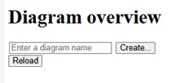
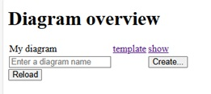
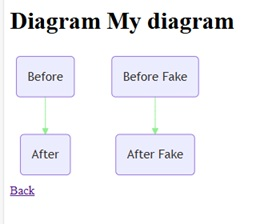

frank-mermaid-dashboard
-----------------------

This project demonstrates figures denoting interconnected IT systems that are turned into dashboards. It is a proof of concept (POC) project, not ready for production.

Starting the application
------------------------

* Clone https://github.com/wearefrank/frank-mermaid-dashboard .
* `mvn clean install`. This builds the backend Java files and the frontend Angular project inside this GitHub repository and puts the result in the directory where `docker-compose.yml` expects it.
* `docker compose up`. There is a `docker-compose.yml` that defines volumes to the relevant directories of this project.

Usage
-----

The purpose of this project can be demonstrated by doing the following:

* Browse to http://localhost:8090/webcontent/frank-mermaid-dashboard-config. You should see the following figure:

   

* Create diagram by entering a name and clicking Create... . This opens a new page. Enter the contents of file `example-templates/template.txt` in the textbox. Then click Submit. You should see the following:

   

* Click the `show` link. You should see the text `Loading...`. That text should remain there for around 10 seconds. After that, you should see the following figure:

   

* The line between `Before` and `After` corresponds to a Frank adapter that is part of this repository. Please open a different tab in your browser and visit it at http://localhost:8081/.
* Stop adapter "HelloWorld" in this new tab. Return to the previous tab and check that the line between `Before` and `After` becomes red. This may take 10 - 20 seconds.
* The diagram is persistent. You can stop and start the app if you like and the diagram should remain available at http://localhost:8080/webcontent/frank-mermaid-dashboard-config/#/diagram/My%20diagram (in case you named the diagram `My diagram`).
* The only way to clean up diagrams is `mvn clean`. This deletes all files (except `.gitignore`) from directory `database`. That directory is used at a volume so that the app uses a database on the file system of the host computer.